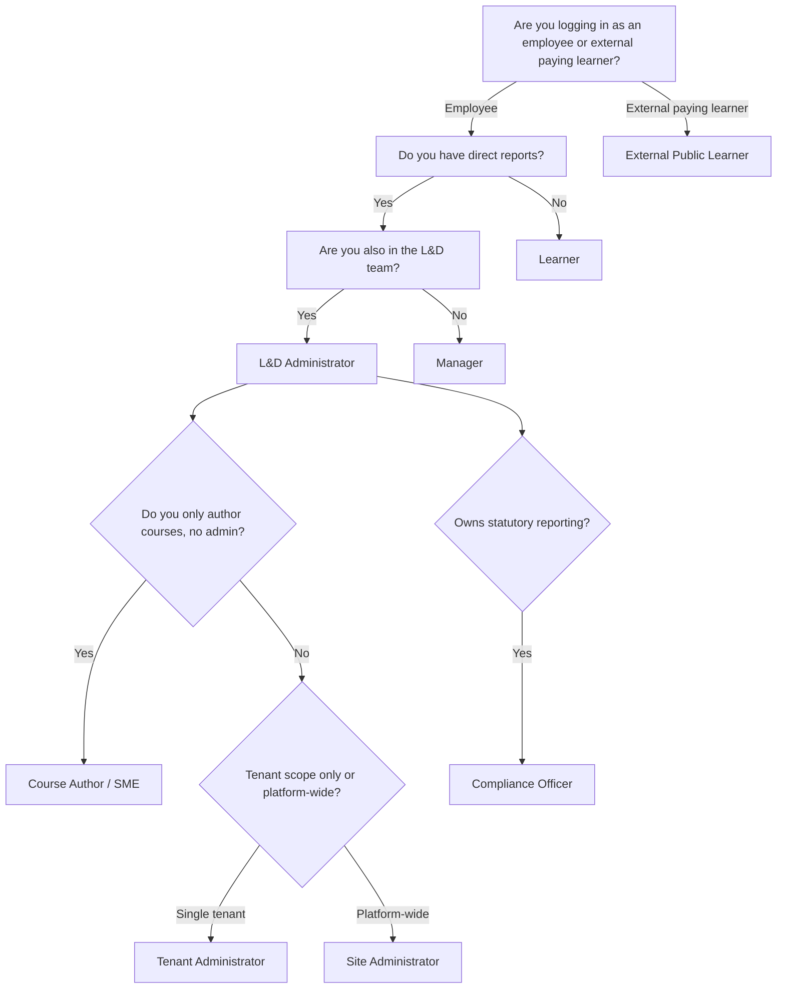

# Personas overview

The platform serves **nine distinct user types** as documented in Section 10 of the [Master Technical &amp; Strategic Documentation (12 May 2026)](../shared/changelog.md). Each persona has its own walkthrough — start there.

If you're unsure which persona applies to you, this decision tree should help:

If you're a developer building an integration, see the [API Consumer guide](09-api-consumer/index.md) — it's the only persona that isn't a UI walkthrough.

## Permission hierarchy at a glance

Each persona inherits all features of the persona above it in this chain:

> Learner ⊆ Manager ⊆ L&amp;D Administrator ⊆ Tenant Administrator (within scope) ⊆ Site Administrator

Compliance Officer, Course Author/SME, and External Public Learner are **orthogonal** — they sit on dedicated permission sets that intentionally don't inherit. This is documented in Section 10 of the master doc and verified in the Phase 7 multi-role User Acceptance Test (14 personas, 12 May 2026).
