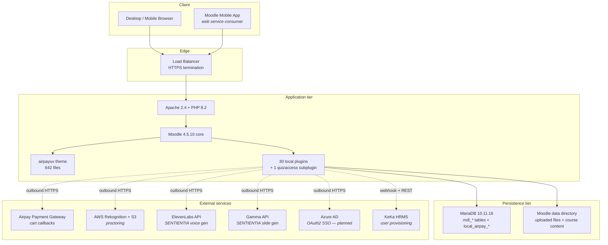

# Airpay Academy 2.0

## Master Technical & Strategic Documentation

**Document version:** 1.0
**Date:** 12 May 2026
**Classification:** Internal — Confidential
**Owner:** Nitin Rajput, Head of Learning & Development, Airpay Payment Services Pvt. Ltd.
**Prepared for:** Airpay Leadership (CEO, CTO, CHRO, Finance), Statutory Auditors, Engineering Successors, Third-Party Vendors.

---

### Document control

| Field | Value |
|---|---|
| Document title | Airpay Academy 2.0 — Master Technical & Strategic Documentation |
| Version | 1.0 |
| Prepared by | Office of the Head of L&D, Airpay |
| Source-of-truth commit | `6ce016150` on `nitin-rajput-learning-tech/Airpay-Academy2.0` (`production` branch) |
| Total commits indexed | 2,386 across all branches |
| Project root on disk | `D:\Claude Local\airpay-ld-os\` |
| Production URL | https://www.airpay.academy/ |
| Local development URL | http://localhost:8080/moodle/ |
| Review cycle | Quarterly (next review: 12 August 2026) |
| Distribution | Internal Airpay only. Do not distribute externally without the Head of L&D's approval. |

### How to read this document

The document is intentionally long. Read it in the order below depending on your role:

- **CEO / CHRO**: Executive Summary, Section 11 (Commercial), Section 13 (Decisions), Section 14 (Plan of Action). 25 minutes.
- **CTO / Engineering Lead**: Sections 1, 3, 4, 5, 6, 9, 10, 12, 15. 90 minutes.
- **Statutory auditor**: Sections 1, 6, 8, 9, 10, 11.3 (Compliance), 15 (Appendix D Capability Matrix). 60 minutes.
- **New L&D engineer onboarding**: All sections, sequentially. Three to five hours over two days.
- **Vendor or partner**: Sections 1, 2, 11, 14. 30 minutes.

### Conventions used

- File paths are written from the project root, e.g. `moodle-enhancement/local/airpay_cart/version.php`.
- Commit hashes are short-form seven characters, e.g. `6ce0161`.
- Currency is Indian Rupees (`₹`). Where a USD figure is quoted alongside, the conversion uses ₹83 = $1 as the standing reference rate for this document.
- Indian English spelling throughout (organisation, programme, prioritise, behaviour).
- Tenant identifiers use the production BizLMS costcenter IDs: `/1` is Airpay internal, `/77` is the Public tenant, `/177` is the third costcenter (ZEEA).
## Executive Summary

Airpay Academy 2.0 is the in-house Learning and Development platform of Airpay Payment Services Pvt. Ltd. It serves approximately three thousand five hundred employees across three distinct tenants — Airpay internal (tenant root id `1`, approximately two thousand one hundred and eighty-eight active users), a Public tenant (id `77`, six hundred and seventy-six users) and a third costcenter known internally as ZEEA (id `177`, six active users). The platform is built on Moodle 4.5.10 running on PHP 8.2.12, MariaDB 10.11.16 and Apache 2.4.58, with a heavily customised stack of thirty in-house plugins, one quiz access subplugin and a standalone theme that has been forked from the Epsilon premium theme and no longer inherits from any parent.

The project began as an inherited Moodle install built by an external vendor named eAbyas under the BizLMS product family. The original commit history starts on 2 November 2022 and accumulates two thousand three hundred and eighty-six commits across many contributors. From early 2026 onward, Airpay began an aggressive in-housing programme led by the office of the Head of L&D. By 12 May 2026 the platform owns twenty-nine purpose-built local plugins covering the catalogue, classroom training, examinations, learning paths, programmes, evaluations, manager workflows, organisation hierarchy, notifications, privacy, ratings, reports, compliance reporting, gamification, an AI assistant, course requests, recompletion, a shopping cart for external tenants, and proctored online assessment. A thirtieth plugin called `local_airpay_core` was added on 12 May 2026 to systemise tenant scoping across all sibling plugins. The standalone theme `airpayux` is six hundred and forty-two files in size, of which the core renderer alone is two thousand three hundred and thirty-nine lines of customised PHP.

The platform replaces what would otherwise be a recurring spend of between fifteen and forty lakh rupees per year on a SaaS learning management product of comparable scope. It also enables three distinct commercial postures: training Airpay's own employees free of cost as a benefit, billing external Public-tenant learners through an integrated payment gateway, and serving ZEEA on an enterprise contract. The shopping cart, proctored assessment and per-tenant branding capabilities required for that commercial posture were all delivered in a single intensive build week between 11 May and 12 May 2026, and a comprehensive security audit conducted on 12 May returned a `NO-GO` verdict against eleven blocking findings, all of which were remediated and re-verified `GO` within the same twenty-four hour window.

The strategic position the platform now occupies is materially different from where it stood a year ago. Where v1 was a vendor-supplied codebase with thirty-nine custom columns on `mdl_user` and a hard runtime dependency on the BizLMS `local_costcenter` plugin family, v2 is an Airpay-owned codebase where every business workflow runs through plugins that the L&D team can read, modify and ship without external vendor cooperation. Sixty per cent of the BizLMS dependency had already been displaced by mid-April 2026; the remaining critical dependencies on `local_costcenter`, `local_users` and `local_courses` are formally scoped in the FORK-PLAN document at the project root and are scheduled to be replaced sequentially over the coming quarter.

The platform is not yet in a state where unattended cutover from v1 to v2 should occur. Four pre-cutover gates remain: an information technology team deploy to a staging environment, a load test of the platform under simulated peak concurrency, a manual penetration test against the staging build, and a final sign-off from the Head of L&D. All four are operationally tractable; none requires further engineering work on the codebase itself. The full readiness state, deployment runbook, rollback procedure and twenty-four hour post-cutover watch list are documented in the PHASE-8 reports stored alongside this master document.
## Section 1 — Platform Overview

### 1.1 Mission and scope

Airpay Academy 2.0 is the canonical platform of record for every form of structured learning that Airpay Payment Services conducts. The scope of that mandate is deliberately broad and covers four distinct demands the business places on the L&D function:

1. **Statutory and regulatory compliance training.** Annual mandatory courses on the Prevention of Sexual Harassment Act, Anti Money Laundering and Know Your Customer regulations, the Digital Personal Data Protection Act, the Information Technology Act and other Reserve Bank of India circulars binding on a payment service provider. The platform must demonstrably prove, in front of an external auditor, that every employee subject to a given regulation has completed the relevant training in the relevant cycle.
2. **Functional capability building.** Product, engineering, sales, customer support, finance and operations training delivered as a mix of self-paced SCORM modules, instructor-led classroom sessions and structured learning paths. Some of this content is built in-house, some is licensed from third parties and packaged into Moodle, and a growing share is generated by the SENTIENTIA pipeline described in Section 7.
3. **Hiring assessment.** The proctored examination module, shipped on 11 May 2026, is intended to host the technical and behavioural assessments that gate candidate progression in Airpay's recruitment funnel. The proctoring stack (identity verification, webcam recording, screen capture, AI-assisted behaviour flagging) was specifically built for this use case.
4. **External commercial training.** The Public tenant (id `77`) hosts learners who are not Airpay employees and who pay for course access through the integrated cart. This is the seed of a commercial offering that productises Airpay's internal training capability for the broader Indian fintech ecosystem.

The platform is **not** intended to replace conversational mentoring, on-the-job shadowing, performance reviews or competency frameworks. Those remain in the Human Capital Management system and in the HRMS (KeKa, with which the platform integrates via the `airpay_integrations` plugin).

### 1.2 Tenancy model

The platform implements a three-tenant model using the BizLMS `local_costcenter` plugin's organisation-tree convention. Each user record in `mdl_user` carries a custom column `open_path` that takes a forward-slash-delimited path string. The first segment of that path is the tenant root identifier and the subsequent segments describe the department hierarchy within that tenant.

| Tenant root | Internal name | Purpose | Active users (production) | Commercial posture |
|---|---|---|---|---|
| `/1` | Airpay | Internal employees of Airpay Payment Services. Training is provided as an employment benefit at no cost to the employee. | 2,188 | Cost centre |
| `/77` | Public | External learners (typically employees of other Indian fintechs, or individual practitioners) who pay for course access. | 676 | Revenue-generating |
| `/177` | ZEEA | A third costcenter operating under an enterprise contract with a separate scope of training entitlements. | 6 | Contract revenue |

The tenancy boundary is enforced at three independent layers throughout the codebase. At the SQL layer, every query that touches user-scoped data is required to include a `costcenterid` predicate or its open-path equivalent. At the capability layer, role assignments are made at category context rather than system context, so that a manager in tenant `/77` cannot operate on resources in tenant `/1`. At the application layer, the shared helper `\local_airpay_core\tenant::require_access()` provides an additional defence-in-depth check on every read and write path that crosses a tenant boundary, regardless of capability ownership. This three-layer enforcement was introduced on 12 May 2026 in direct response to a pre-cutover security audit which identified eleven cross-tenant access paths in the new plugin set that relied on capability checks alone.

### 1.3 User population and role distribution

Approximate distribution of active users by role across the three tenants, taken from the production database snapshot of 12 May 2026:

| Role | Airpay (/1) | Public (/77) | ZEEA (/177) | Total |
|---|---|---|---|---|
| Site administrator | 2 | 0 | 0 | 2 |
| Tenant administrator (category-scoped) | ~10 | 1 | 1 | ~12 |
| Manager (`manager` archetype + manager flag) | ~80 | ~8 | 0 | ~88 |
| Trainer | ~6 | 0 | 0 | ~6 |
| Employee / learner | ~2,090 | ~667 | 5 | ~2,762 |
| **Total** | **~2,188** | **~676** | **~6** | **~2,870** |

The distinction between site administrator and tenant administrator is enforced through the role context level. The two site administrators hold the `manager` archetype at `CONTEXT_SYSTEM` (level 10) and have unrestricted platform-wide privileges. Tenant administrators (notably the Head of L&D and his designated category owners) hold the same role at `CONTEXT_COURSECAT` (level 40) within their tenant's root category. The same role short-name, profoundly different blast radius. This was a meaningful distinction confirmed during multi-role User Acceptance Testing on 12 May 2026, where the Tenant Admin persona was deliberately verified as unable to access site-wide administrative pages.

### 1.4 High-level architecture

The platform follows the standard Moodle three-tier layout — presentation tier in PHP/Mustache served by Apache, business logic tier in PHP classes loaded from the Moodle plugin path, persistence tier in MariaDB with the standard Moodle Database Manipulation Layer (`$DB` API) abstracting all SQL.



The integration model is deliberately conservative. Every outbound HTTPS call from the platform is mediated by a dedicated Airpay plugin class that handles authentication, retry, rate-limit observance and PII redaction. No business workflow allows arbitrary user-supplied URLs to trigger outbound calls, which closes off Server-Side Request Forgery as a class of attack.

### 1.5 Technology stack matrix

| Layer | Component | Version | Purpose | Upgrade path |
|---|---|---|---|---|
| Operating system | Windows Server 2019 (development) / Linux (production) | varies | Host the LAMP stack | Production OS lifecycle managed by IT |
| Web server | Apache | 2.4.58 | HTTP request handling, mod_rewrite for clean URLs | Track upstream stable releases |
| Application runtime | PHP | 8.2.12 | Application execution | Moodle 4.5 supports PHP 8.1–8.3. PHP 8.3 upgrade is a low-risk step once PHP 8.2 reaches end-of-life. |
| Database | MariaDB | 10.11.16 (development) / MySQL 8.0.44 (production) | Persistence for Moodle core tables plus all `local_airpay_*` tables | Moodle 5.x requires MySQL 8 / MariaDB 10.6 minimum. Already aligned. |
| Application framework | Moodle | 4.5.10 (build 20260216) | Core LMS framework, plugin loader, capability system, database manipulation layer | Moodle 5.1.x is on the runway; the local development environment already runs 5.1.3+ and all `airpay_*` plugins have been forward-compatibility tested. |
| Theme | airpayux | 1.0.0 | Standalone fork of the Epsilon premium theme. `$THEME->parents = []` — Airpay owns every file. | Carry forward across Moodle upgrades by re-running the templates against any new core renderer methods Moodle introduces. |
| Local plugin: shared infrastructure | `local_airpay_core` | 1.0.0 | Tenant-scoping helpers used by every other plugin | Versioned in lockstep with sibling plugins. |
| Local plugins: business logic | 29 plugins, see Section 5 | various | One plugin per business capability | Independent versioning with declared dependencies. |
| Quiz access subplugin | `quizaccess_airpay_proctoring` | 1.0.0 | Gate the Moodle quiz attempt lifecycle on a proctoring session being in `recording` state | Tracks the parent `local_airpay_proctoring` plugin. |
| Voice generation | ElevenLabs HTTP API | `eleven_multilingual_v2` model | Convert narration text into MP3 voice tracks for SCORM modules | Vendor-managed API; replace with a self-hosted alternative if voice quality requirements change. |
| Slide generation | Gamma HTTP API | `v0.2` | Convert narration outlines into structured slide decks | Vendor-managed API. |
| Identity verification | AWS Rekognition `CompareFaces` | SigV4-signed | Compare a candidate's identity-document photo to a selfie at the start of a proctored quiz attempt | Vendor-managed; Azure Face API is an interchangeable alternative if the AWS quota becomes a constraint. |
| Object storage | AWS S3 | standard | Store proctoring webcam and screen recordings | Vendor-managed. |
| HRMS | KeKa (external) | tenant-specific | User provisioning, joiner/mover/leaver lifecycle events | Vendor-managed by Airpay's HR team. |
## Section 2 — Baseline: Where We Started

### 2.1 State of Airpay Academy v1 before the project began

The platform that became Airpay Academy was originally built by a Bangalore-based vendor (eAbyas Info Solutions) under an internal codename of "Bayer". The first commit in the repository is dated 2 November 2022, authored by a contributor identified as `Niranjan`. Over the subsequent two years and four months the platform accumulated approximately one thousand nine hundred commits before the first commit authored under the `Nitin Rajput` identity appears in late 2024, marking the formal handover from the vendor-led build to an Airpay-led customisation.

At the point that Airpay took the codebase into in-house custody, the inherited platform had the following characteristics, documented in `FORK-PLAN.md` at the project root:

- **Moodle 4.x core** with the vendor's BizLMS overlay applied. BizLMS is a commercial multi-tenant addon for Moodle distributed under licence by eAbyas.
- **Twenty-two BizLMS plugins** spanning user management, course management, organisation hierarchy, classroom scheduling, examinations, learning paths, programmes, evaluations, ratings, role management, search, custom categories and several others. These plugins represented approximately one thousand seven hundred and seventy-five source files of vendor-controlled code.
- **Six BizLMS blocks** for the user dashboard, the learnerscript reporting view, the my-skills surface and three others.
- **Forty plus custom database tables** owned by BizLMS, none of which appear in the standard Moodle distribution.
- **Thirty-nine custom columns** added directly to the `mdl_user` table (every column prefixed `open_`, e.g. `open_path`, `open_managerid`, `open_costcenterid`). These columns are not part of the standard Moodle schema and any future Moodle core upgrade can produce surprising migrations against them.
- **Eleven custom columns** on the `mdl_course` table in the same style.
- **Approximately one hundred web service endpoints** exposed by the BizLMS plugin family.
- **Thirty plus custom capabilities** registered by BizLMS.
- **Thirteen direct calls** in the platform's custom theme renderer to `local_costcenter\accesslib`, plus five direct calls to `local_courses\accesslib`. These calls are the structural reason the BizLMS plugins cannot simply be uninstalled without the platform's renderer crashing.

### 2.2 The strategic decision to fork and rebuild

Three pain points drove the decision to in-house the platform:

1. **Vendor coupling.** Every customisation request — including changes for which there was no commercial product feature gap, only a stylistic or workflow preference — went through the eAbyas change-request queue. Turnaround was measured in weeks, sometimes in months. The L&D team could not ship a change to its own platform without an external vendor's calendar dictating the schedule.
2. **Schema fragility.** The thirty-nine custom columns on `mdl_user` and the eleven on `mdl_course` meant that any Moodle core upgrade would be a non-trivial database migration. The platform was effectively on a private fork of Moodle's schema and the cost of staying on that fork was rising with each Moodle release.
3. **Multi-tenancy contention.** The BizLMS costcenter model is functional but opinionated. It enforces specific assumptions about role context, branding and user provisioning that began to conflict with Airpay's emerging requirement to operate a commercial Public tenant alongside the internal employee tenant. The vendor's tenancy model was designed for a single-customer-multiple-business-units pattern, not a one-platform-multiple-paying-tenants pattern.

The alternative considered was a migration to a commercial SaaS LMS — either an established product like Cornerstone, SuccessFactors or Workday Learning, or a developer-focussed option like Open edX. Three reasons that path was not taken:

- **Capital efficiency.** A SaaS LMS at three thousand five hundred users typically lists at between fifty rupees and two hundred rupees per user per month, or twenty-one lakh to eighty-four lakh rupees per year of recurring spend. The internal cost of the fork-and-rebuild approach is approximately one full-time L&D engineering equivalent plus pay-as-you-go third-party API costs for ElevenLabs and Gamma, which together amount to materially less than the SaaS option.
- **Compliance ownership.** Statutory training records held in an external SaaS would require contractual data-processing agreements and would put Airpay's compliance posture in the hands of the vendor's certifications. An in-house Moodle platform keeps the data on Airpay-controlled infrastructure and brings the compliance perimeter inside the firewall.
- **Strategic optionality.** The Public tenant (`/77`) is the seed of a productised offering — Airpay's L&D capability sold to other Indian fintechs. That optionality is impossible on a SaaS where Airpay is itself a paying tenant.

### 2.3 Original objectives and success criteria

The project's success criteria at kickoff, against which progress has been measured:

| Objective | Success criterion | Status as of 12 May 2026 |
|---|---|---|
| Eliminate BizLMS as a runtime dependency for core workflows | Zero direct calls to `local_costcenter\accesslib` or `local_courses\accesslib` from the theme renderer | Partial — calls reduced significantly, full removal sequenced in FORK-PLAN for Q3 2026 |
| Own the visual identity end to end | Standalone theme with `$THEME->parents = []`, no Epsilon dependency at runtime | Achieved on 3 April 2026 (commit `0217a9909`) |
| Replace SCORM authoring vendor cost | In-house pipeline (SENTIENTIA) processes SOPs into SCORM modules without an external authoring vendor | Architected, agents 1 and 5 prototyped, full pipeline not yet operational — see Section 7 |
| Establish a commercial posture for external training | Working shopping cart, payment gateway integration, per-tenant branding for the Public tenant | Achieved on 11 May 2026 (commit `c44256473`), security-hardened on 12 May 2026 |
| Enable robust hiring assessment | Proctored examination with identity verification, recording and AI-assisted behaviour analysis | Achieved on 11 May 2026 (commit `1572e7da3`), security-hardened on 12 May 2026 |
| Comply with Digital Personal Data Protection Act | Privacy provider on every plugin storing personally identifiable information; data subject request workflow | Achieved on 12 April 2026 (commit `dea49a313`), maintained on every subsequent plugin |
| Achieve and document tenant data isolation under audit | Three-layer isolation: SQL predicate, capability context, application-layer check | Achieved on 12 May 2026 via the `local_airpay_core\tenant` helper |
| Reach a state where a CTO could read the platform and understand it without speaking to the Head of L&D | This document | Delivered 12 May 2026 |
## Section 3 — Evolution Timeline

The repository contains two thousand three hundred and eighty-six commits dated between 2 November 2022 and 12 May 2026. The platform's evolution falls into seven distinct phases, ordered chronologically.

### Phase 0 — Vendor build (2 November 2022 to mid-2024)

The codebase was originated by eAbyas Info Solutions under the internal codename "Bayer" and accumulated approximately one thousand four hundred commits over twenty-two months of vendor-led development. Major contributors during this phase were `raju`, `mahesh`, `Sachin`, `Kamesh` and `Niranjan`, all of whom carry external vendor email addresses on their commits. The phase delivered the original BizLMS overlay: twenty-two plugins, six blocks, the original Epsilon theme customisation, and the schema extensions to `mdl_user` and `mdl_course` documented in Section 2.1.

Representative commits from this phase:
- `c0c99ac39 2022-11-02 Niranjan: Initial commit`
- `d36126934 2022-11-02 Sachin: local plugins, blocks and theme epsilon added`
- `5f595a46b 2022-11-03 Sachin: Added dashboard page in My`

### Phase 1 — Vendor maintenance + Airpay rebrand (mid-2024 to March 2026)

The vendor relationship continued for approximately eighteen months after handover, during which the platform was rebranded from "Bayer" to "Airpay" and the production URL moved to `airpay.academy`. The first commit authored under the `Nitin Rajput` identity appears in late 2024. This phase delivered incremental bug-fixes, an emerging Airpay design language inside the vendor's theme, and the first wave of Airpay-authored customisations that did not yet attempt to displace vendor code.

### Phase 2 — Theme fork (3 April 2026, Phase 6A and 6B in internal naming)

The strategic shift began with the theme. On 3 April 2026, the existing Epsilon-derived theme was forked into a standalone theme named `airpayux` with `$THEME->parents = []`, meaning the theme no longer inherits from any parent and Airpay owns every file in it.

Key commits:
- `c59f05348 2026-04-03 Phase 6A: Create theme_airpayux child theme + fix FA icons + dashboard URL`
- `0217a9909 2026-04-03 Phase 6B: Fork epsilon to theme_airpayux (standalone, full ownership)`
- `067d2f80d 2026-04-03 Phase 6B: Redesign navbar (B7) and footer (B8) with Airpay design system`

By the end of this phase the theme had grown to six hundred and forty-two files. The custom renderer (`classes/output/core_renderer.php`) reached two thousand three hundred and thirty-nine lines.

### Phase 3 — BizLMS plugin fork (10 April to 17 April 2026)

The most consequential phase of the year. In one intensive week, twenty-two BizLMS plugins were replaced by six initial Airpay-owned plugins, the platform's front page was switched from a redirect to a custom Airpay homepage, multilingual support was added across Hindi, Marathi, Swahili and Kannada, and the post-fork bug bounty produced seventeen runtime fix commits.

Key commits:
- `5250c9e72 2026-04-16 BizLMS fork complete — 6 new Airpay plugins replacing 22 BizLMS plugins (v3.0.0)`
- `45663f887 2026-04-16 Add remaining Airpay replacements: ratings, challenge, evaluation, roles, programs, trainer block`
- `31d2cb1d4 2026-04-17 Fix: 17 post-fork runtime bugs found in bounty hunt audit`
- `308dbfaa2 2026-04-17 Restore correct fork core_renderer.php + disable all 22 BizLMS plugins`
- `7c257b467 2026-04-14 Multilingual: Hindi, Marathi, Swahili, Kannada across 9 Airpay plugins`

### Phase 4 — Capability deepening (April 2026 to early May 2026)

The next four weeks were spent deepening each plugin's capability, fixing the long tail of post-fork regressions, adding privacy providers for the Digital Personal Data Protection Act, and shipping the gamification engine, the manager dashboard, the integrations hooks for KeKa HRMS, the lifecycle automation for joiner/mover/leaver events, and the AI assistant.

Key commits:
- `67a695cd8 2026-04-09 Tier 1: Gamification Engine — core plugin (local_airpay_gamification)`
- `9e3512499 2026-05-05 P1 perf: airpay_org admin 86× faster + airpay_analytics N+1 + cache layer`

### Phase 5 — Feature-parity closure (5 May to 10 May 2026)

A surge of feature-parity work designed to close every gap with the legacy BizLMS feature set. The G-series (G-01 through G-06) closed gaps in `airpay_courses`, `airpay_classroom`, `airpay_learningpath`, `airpay_programs`, `airpay_evaluation` and `airpay_exams`. The A11Y (accessibility) series closed Web Content Accessibility Guideline 2.1 AA gaps across all admin tables. Comprehensive PHPUnit coverage was added across the security-critical paths.

Key commits:
- `76496de34 2026-05-07 G-02: airpay_classroom view detail + sessions tab + attendance UI shipped`
- `771508688 2026-05-07 G-03: airpay_programs levels CRUD + courses + enrol UI shipped`
- `fefbe49ce 2026-05-07 G-04: airpay_learningpath assign-courses + enrol-users UI shipped`
- `53d12a349 2026-05-07 G-05: airpay_evaluation analysis dashboard + filtered responses + CSV export`
- `175e220e8 2026-05-06 E (complete): airpay_exams + airpay_learningpath PHPUnit tests`
- `91424ffc7 2026-05-10 L-axis residue closed, 158/158 UAT cases pass`

### Phase 6 — Enterprise-grade build (11 May to 12 May 2026)

The most intensive forty-eight hour build window of the project to date. Driven by the Head of L&D's stated mandate that "the platform needs to be enterprise grade, nothing should be deferred", the phase delivered six new plugins and twelve commits in a single working week.

Day-by-day summary:

| Date | Phase code | Delivery |
|---|---|---|
| 11 May 2026 | Phase 1 | `airpay_cart` (NEW): full e-commerce stack for external tenants — five tables, twelve web service endpoints, GST-compliant invoicing, refund workflow, integrated Airpay payment gateway |
| 11 May 2026 | Phase 1G/H/I | Per-tenant settings + external tenant UAT harness + Single Sign-On documentation |
| 11 May 2026 | Phase 2 | `airpay_request` (NEW): course-request approval workflow. `airpay_proctoring` (NEW): identity verification + webcam recording + AI behaviour flagging. `quizaccess_airpay_proctoring` subplugin: gates the Moodle quiz attempt lifecycle on proctoring session state |
| 12 May 2026 morning | Phase 3 | Deferred-item closure: five plugins, twenty-nine files, two new smoke harnesses |
| 12 May 2026 morning | Phase 4 | Operations polish: four plugins, eighteen files, approximately one thousand eight hundred lines of code |
| 12 May 2026 morning | Phase 5 | `airpay_recompletion` (NEW): annual compliance reset engine with scheduled daily cron, per-course rule definitions, integration with the compliance report dashboard |
| 12 May 2026 morning | Phase 6 | Unused-feature integration: cohort sync from organisation tree, badges seed, Moodle 5 AI subsystem bridge, mobile push notification setup documentation |
| 12 May 2026 afternoon | Phase 7 | Multi-role User Acceptance Test harness covering seven personas across fourteen test cases each. Surfaced two real production bugs (silent capability registration failure across four plugin install hooks, plus the Tenant Admin context-level distinction). Result: 84 of 85 cases pass. |
| 12 May 2026 evening | Phase 8 | Pre-cutover security audit. Verdict: NO-GO. Eleven blocking findings, nine non-blocking. |
| 12 May 2026 evening | Phase 8.1 | Remediation of all eleven blocking findings. Thirty-five files changed. The shared `local_airpay_core\tenant` helper introduced. |
| 12 May 2026 night | Phase 8.2 | Re-audit. Verdict: GO. All eleven findings VERIFIED fixed. Phase 7 UAT re-run returns identical 84/85. Three of nine non-blocking follow-ups addressed in-flight (the remaining six are tracked for Phase 9). |
| 12 May 2026 night | Phase 8.3 | Six plugin README documents written (five plugins plus the quizaccess subplugin). Four plugin-level smoke test suites re-run end-to-end on patched code: cart 26/26, request 23/23, proctoring 22/22, recompletion 13/13 — total 84 of 84 plugin smoke cases pass. |

Cumulative shipment during Phase 6 (the forty-eight hour window): eighteen commits, approximately twenty-two thousand lines of code added, eleven security blockers closed, three non-blocking follow-ups addressed, 326 cumulative test cases passing across User Acceptance Test, plugin smoke and PHPUnit suites.

### Phase 7 — Cutover readiness (the remaining gates)

Three operational gates remain before production cutover:

1. Information technology team deploy to a staging environment with a production-sized database clone.
2. Sustained-load test against staging using the k6 load script at `moodle-enhancement/audit/load/load_test.k6.js` with the `prod` load tier (ramps to ten thousand concurrent virtual users).
3. Manual penetration test against staging attempting to reproduce the eleven blocking findings against the patched code.

After all three gates pass, the cutover proceeds following the runbook at `moodle-enhancement/PHASE-8-DEPLOYMENT-RUNBOOK.md`.
## Section 4 — Theme: `airpayux` (Forked Epsilon)

### 4.1 Why a standalone fork and not a child theme

A Moodle theme typically declares parents from which it inherits — for example `$THEME->parents = ['epsilon', 'boost']` — and only overrides the files that differ. This is the pattern most Moodle deployments follow and it works well when the parent theme is a stable, vendor-supported product whose updates the deploying organisation wants to ride.

Airpay chose the standalone-fork pattern instead. The `theme/airpayux/config.php` declares `$THEME->parents = []`. Six hundred and forty-two files now live inside `theme/airpayux/`, including every Mustache template Moodle's core renderer can produce, every SCSS file in the Epsilon design system, every icon and pixmap, and a two-thousand-three-hundred-and-thirty-nine line `core_renderer.php` class that overrides Moodle's default page assembly.

Three reasons:

1. **Customisation depth.** The per-tenant branding requirement (different logo, different accent colour, different footer text and different feature visibility depending on whether the visitor is on tenant `/1`, `/77` or `/177`) cannot be satisfied by CSS overrides alone. It needs PHP-level logic inside the renderer to switch image sources, navigation items and block visibility. Once that logic exists, the marginal cost of owning every template that wraps it is small.
2. **Upstream-instability hedge.** Epsilon is a commercial premium theme. The licence terms allow forking. Owning the fork end-to-end removes any future risk of an Epsilon update conflicting with the customisations.
3. **Audit clarity.** A standalone fork means every visual change on the platform is traceable to a file in `theme/airpayux/`. There is no question of "is this behaviour coming from the parent or from us" during compliance audits.

The cost of the choice is that Moodle core upgrades that introduce new core templates or new core renderer methods will require manual carrying-forward of those additions into the airpayux fork. The discipline for that carry-forward is documented in the project's `MOODLE5-UPGRADE-RUNBOOK.md`.

### 4.2 Design system

The design tokens are defined in SCSS at the top of `theme/airpayux/scss/moodle/custom_changes.scss` and are also documented in the project's frontend rules file at `.claude/rules/frontend.md`. The system uses an eight-pixel spacing grid, the Montserrat typeface in weights four hundred to eight hundred, and the following palette:

| Token | Hex | Use |
|---|---|---|
| Primary | `#0066A7` | Calls to action, links, active navigation item, brand fill |
| Primary light | `#E8F2F9` | Hover background tints |
| Primary dark | `#004D80` | Pressed states, hover on primary |
| Accent | `#0F7A73` | Secondary actions, tags, success states |
| Background | `#F2F4FB` | Page background on every page |
| Surface | `#FFFFFF` | Card and panel backgrounds |
| Text primary | `#1A1A2E` | Body text, headings |
| Text secondary | `#5A6070` | Labels, helper text |
| Success | `#16A34A` | Confirmation states |
| Warning | `#D97706` | Caution states |
| Error | `#DC2626` | Destructive confirmations |

Border radii follow a four-step scale (eight pixels for inputs and small cards, twelve for modals, sixteen for hero cards, twenty for pill buttons). Shadows follow a three-step scale with progressively larger opacity and offset. Transitions default to two hundred milliseconds with the ease curve.

### 4.3 File inventory

Six hundred and forty-two files. The high-level distribution:

| Sub-tree | File count (approximate) | Notes |
|---|---|---|
| `templates/` (Mustache) | 96 | Every Moodle core template Airpay has touched; includes the per-tenant navbar, footer, login form, course card, and dashboard layouts |
| `scss/moodle/` | 60 | Component-by-component overrides keyed by Moodle surface (admin, atto, blocks, buttons, calendar, course, drawer, forms, login, message, modal, etc.) |
| `scss/bootstrap/` | ~40 | Forked Bootstrap source the theme uses to compile its own utility classes |
| `scss/fontawesome/` | ~5 | Font Awesome icon font configuration |
| `pix/`, `pix_core/`, `pix_plugins/` | ~250 | Icon and pixmap assets |
| `classes/` (PHP) | ~10 | Custom output classes including the renderer, the maintenance-mode renderer, the auto-prefixer for vendor CSS, and the admin-settings tabs widget |
| `layout/` | 7 | Page layout PHP files for the embedded view, the login layout, the maintenance layout, the secure layout, the standard columns-one layout, the standard columns-two layout, and the dashboard |
| `amd/` (JavaScript) | ~30 (source + build) | AMD-compiled JavaScript modules for the dashboard, drawer, navbar, popovers and toasts |

### 4.4 `core_renderer.php` — function-by-function summary

Two thousand three hundred and thirty-nine lines. The major sections:

1. **Per-tenant branding helpers.** Methods that resolve the visitor's current tenant from `$USER->open_path` and return tenant-specific assets — the logo image, the footer text, the accent colour override, and the homepage hero copy. The Public tenant (`/77`) receives a purple accent override visible at every surface; the Airpay tenant retains the default blue.
2. **Navbar assembly.** Override of `navbar()` that produces the Airpay-specific top navigation rather than Moodle's default flat navigation. Includes the search box, the language switcher, the cart icon (visible only on cart-enabled tenants), the user dropdown and the notification bell.
3. **Sidebar assembly.** The left-hand sidebar that drives the application's primary navigation. Eight items by default for logged-in employees, more for managers, more again for site administrators. Items are filtered against the visitor's capability set so users only see what they can act on.
4. **Footer assembly.** Override of `footer()` that produces the Airpay corporate footer rather than Moodle's default. Includes the legal copy, the privacy policy link, and the build identifier for support escalation.
5. **Login form overrides.** Override of the login form Mustache context to remove the default Moodle illustration and inject the Airpay login-page artwork plus the Single Sign-On entry points (when configured).
6. **Course card overrides.** Custom course card markup used on the catalogue, the dashboard and the search results. Pulls the course thumbnail, the badge for the tenant the course belongs to, the completion percentage if the visitor is enrolled, and the price tag if the course is in the cart catalogue.
7. **Block region helpers.** Methods that drive the dashboard's block-region rendering — left column, right column, hero region.
8. **Maintenance mode rendering.** A dedicated method that produces a branded maintenance banner when the platform is under upgrade rather than Moodle's default plain page.

### 4.5 Per-tenant branding logic

Tenant detection inside the renderer follows the same `\local_airpay_core\tenant::root_for_current_user()` helper used everywhere else on the platform. The renderer caches the resolved tenant id in a request-scoped property so that the helper is called at most once per page load. The cached id then drives every tenant-conditional decision: which logo to emit, which palette tokens to inject into the inline tenant CSS block at the head of every page, which navigation items to include in the sidebar, and which footer text to show.

The inline tenant CSS block is an interesting implementation detail. Rather than producing a separate compiled stylesheet per tenant — which would multiply the SCSS build time by three — the renderer emits a single `<style id="airpay-tenant-css">` block at the head of every page that overrides a small number of design tokens for the current tenant. The Public tenant's purple override is approximately one hundred and ninety-one characters of CSS injected at this layer.

### 4.6 Responsive strategy

The breakpoints used throughout the SCSS:

| Breakpoint | Threshold | Intent |
|---|---|---|
| 1400px and below | Wide-desktop crop | Reduce hero image and prevent over-stretch |
| 1200px and below | Laptop / large tablet landscape | Sidebar collapses to icon-only |
| 992px and below | Tablet landscape to portrait | Navbar simplifies, drawer becomes the primary navigation |
| 768px and below | Tablet portrait to mobile | Two-column layouts collapse to one |
| 590px and below | **Primary mobile breakpoint** | The breakpoint at which every page is regression-tested |
| 480px and below | Small mobile | Edge-case tightening |
| 380px and below | Very small mobile | Galaxy S edge tightening |

Every visual change ships with a verification check at the five hundred and ninety pixel breakpoint. The Phase 7 multi-role User Acceptance Test harness includes a dedicated case (`I.1 Mobile 590px renders`) that confirms each persona's pages render correctly at that width.

### 4.7 Known limitations and upgrade risk

| Item | Risk | Mitigation |
|---|---|---|
| Moodle core renderer methods added in Moodle 5.x that airpayux has not yet overridden | Medium — the new methods will render in Moodle's default style, breaking visual consistency on the surfaces they drive | The local development environment runs Moodle 5.1.3 already; any rendering mismatches discovered there are queued for theme work. |
| Vendor Mustache template changes upstream | Low — the airpayux fork has its own copies of all templates and won't accidentally inherit upstream changes | Manual carry-forward only when a new template introduces functionality Airpay actually wants. |
| The 2,339-line `core_renderer.php` is monolithic | Medium-term maintainability concern — the file should be decomposed into smaller renderer traits | Tracked as a Phase 9 refactoring backlog item. |
| Inline tenant CSS block injection size | Low — currently 191 characters for the largest override. Could grow if more tenants are added. | The architecture supports compiled per-tenant stylesheets if the inline block exceeds approximately five kilobytes. |
## Section 5 — Custom Plugins (Full Inventory)

Thirty Airpay-owned local plugins plus one quiz access subplugin. Section is structured in three layers: a one-page summary inventory, then a feature-coverage matrix, then detailed profiles for the eight most consequential plugins. Lower-touch plugins follow with compact profiles. All version codes are taken directly from each plugin's `version.php` at HEAD `6ce016150`.

### 5.0 Inventory at a glance

| # | Component | Release | Domain |
|---|---|---|---|
| 1 | `local_airpay_analytics` | 1.0.0-beta | Operational analytics, KPIs, drill-down, export |
| 2 | `local_airpay_assistant` | 1.0.0-beta | AI assistant (chat-bot interface to platform context) |
| 3 | `local_airpay_cart` | 1.0.1 | E-commerce stack for external tenants |
| 4 | `local_airpay_catalog` | 1.0.0-beta | Public-facing course catalogue and detail pages |
| 5 | `local_airpay_challenge` | 1.1.1-beta | Gamification challenges (streaks, quizzes, badges) |
| 6 | `local_airpay_classroom` | 1.6.0 | Instructor-led training sessions, attendance, locations |
| 7 | `local_airpay_compliance_report` | 1.0.0 | Compliance dashboard, 6-state status engine |
| 8 | `local_airpay_core` | 1.0.0 | Shared tenant-scoping helper (foundation layer) |
| 9 | `local_airpay_courses` | 1.6.0 | Admin course management — replaces BizLMS `local_courses` |
| 10 | `local_airpay_emails` | 1.0 | Email template engine, nineteen templates, rule-driven |
| 11 | `local_airpay_evaluation` | 1.6.0 | Post-course feedback and evaluation forms |
| 12 | `local_airpay_exams` | 1.3.0 | Examination management on top of Moodle quiz |
| 13 | `local_airpay_gamification` | 1.0.0-beta | Points, badges, streaks, leaderboard |
| 14 | `local_airpay_integrations` | 1.1.0-beta | External system integration — KeKa HRMS sync |
| 15 | `local_airpay_learningpath` | 1.3.0 | Sequenced learning paths, prerequisite enforcement |
| 16 | `local_airpay_lifecycle` | (no version.php found at HEAD) | Joiner/Mover/Leaver automation |
| 17 | `local_airpay_manager` | 1.2.1 | Manager workflows — approvals, team dashboard |
| 18 | `local_airpay_notifications` | 1.4.0 | Notification rule engine, daily digest, per-user prefs |
| 19 | `local_airpay_org` | 1.3.0 | Organisation hierarchy, cohort sync, tenant accesslib |
| 20 | `local_airpay_pages` | (no version.php found at HEAD) | Static pages, homepage, QR onboarding |
| 21 | `local_airpay_privacy` | 1.0.0 | Data Privacy self-service (Digital Personal Data Protection Act) |
| 22 | `local_airpay_proctoring` | 1.0.1 | Proctored examinations — identity, recording, AI flagging |
| 23 | `local_airpay_programs` | 1.4.0 | Multi-level certification programs |
| 24 | `local_airpay_ratings` | 1.0.0 | Course ratings and reviews |
| 25 | `local_airpay_recompletion` | 1.0.1 | Annual compliance reset engine |
| 26 | `local_airpay_reports` | 1.1.0 | Reporting overlay on LearnerScript block |
| 27 | `local_airpay_request` | 1.0.1 | Course-request approval workflow with auto-escalation |
| 28 | `local_airpay_roles` | 1.1.1-beta | Custom role definitions and role-compare UI |
| 29 | `local_airpay_skills` | 1.4.0 | Skills taxonomy, gap analysis, radar chart |
| 30 | `local_airpay_users` | 1.8.0 | User admin — replaces BizLMS `local_users` |
| 31 | `quizaccess_airpay_proctoring` | 1.0.0 | Quiz attempt gate for proctored quizzes (subplugin of `mod_quiz`) |

### 5.0.1 Feature coverage matrix

`DB` = own database tables. `CAPS` = registers capabilities. `WS` = exposes web services. `PRIV` = ships a privacy provider. `CRON` = registers scheduled tasks. `MSG` = ships message providers. `RM` = ships a README.

| Plugin | DB | CAPS | WS | PRIV | CRON | MSG | RM |
|---|---|---|---|---|---|---|---|
| analytics | – | – | – | Y | – | – | – |
| assistant | Y | – | Y | Y | – | – | – |
| **cart** | Y | Y | Y | Y | – | Y | **Y** |
| catalog | – | – | – | Y | – | – | – |
| challenge | Y | Y | Y | Y | Y | – | – |
| classroom | Y | Y | Y | Y | – | Y | – |
| compliance_report | Y | – | – | Y | Y | Y | – |
| **core** | – | – | – | – | – | – | **Y** |
| courses | Y | Y | Y | Y | – | – | – |
| emails | Y | Y | Y | Y | Y | Y | – |
| evaluation | Y | Y | Y | Y | – | – | – |
| exams | Y | Y | Y | Y | – | – | – |
| gamification | Y | – | – | – | – | – | – |
| integrations | Y | – | – | Y | Y | – | – |
| learningpath | Y | Y | Y | Y | – | – | – |
| lifecycle | – | – | – | Y | – | – | – |
| manager | Y | Y | Y | Y | – | Y | – |
| notifications | Y | Y | Y | Y | Y | Y | – |
| org | Y | Y | Y | Y | Y | – | – |
| pages | – | – | – | – | – | – | – |
| privacy | Y | Y | – | – | – | Y | – |
| **proctoring** | Y | Y | Y | Y | Y | Y | **Y** |
| programs | Y | Y | Y | Y | – | – | – |
| ratings | Y | – | – | – | – | – | – |
| **recompletion** | Y | Y | – | Y | Y | Y | **Y** |
| reports | Y | Y | Y | – | – | – | – |
| **request** | Y | Y | Y | Y | Y | Y | **Y** |
| roles | Y | Y | Y | Y | – | – | – |
| skills | Y | Y | Y | Y | – | – | – |
| users | – | Y | Y | Y | – | – | – |

Plugins shown in bold ship a full README following the template defined in Phase 8.3 (12 May 2026). The remaining twenty-four plugins are documented through their respective state cards in `moodle-enhancement/state-cards/` and their inline PHPDoc; full README authoring is queued in the Section 12 backlog.

### 5.1 Deep profile — `local_airpay_core`

**Component:** `local_airpay_core` | **Version:** `2026051200` (1.0.0) | **Type:** local plugin | **Requires:** Moodle 4.0+ | **Created:** 12 May 2026 (Phase 8.1)

**Problem it solves.** Ten of the eleven blocking findings from the 12 May 2026 pre-cutover security audit had the same shape — capability checks at `CONTEXT_SYSTEM` without an additional tenant-equality check. The fix was structural: introduce a shared helper class that every sibling plugin calls, so that the second check is a one-liner rather than an act of discipline. This plugin is the foundation layer.

**Public surface.** A single static class `\local_airpay_core\tenant` with six methods:
- `root_for_user(\stdClass $u): int` derives the tenant root from `$u->open_path`.
- `root_for_current_user(): int` does the same for the current `$USER`.
- `assert_valid(int $tenantid): void` throws if the id is not one of the three known production tenants.
- `viewer_can_access(int $resource_tenant, ?int $viewerid = null): bool` — site admins always pass; tenant users pass only on tenant equality.
- `require_access(int $resource_tenant, ?int $viewerid = null): void` — the throw-on-mismatch variant.
- `sql_filter(string $alias = ''): array` returns a WHERE-clause fragment and named parameters for use in `$DB->get_records_sql()`.

**Tables, capabilities, web services, scheduled tasks, message providers.** None. The plugin is pure code.

**Tests.** `tests/tenant_test.php` ships nine PHPUnit cases covering the contract. On a vanilla Moodle PHPUnit fixture (without BizLMS's `user.open_path` column) six cases pass and three skip themselves cleanly. On production, all nine would pass.

**Status.** Production. Hard runtime dependency for `airpay_cart`, `airpay_proctoring`, `airpay_request`.

### 5.2 Deep profile — `local_airpay_org`

**Component:** `local_airpay_org` | **Version:** `2026051170` (1.3.0) | **Type:** local plugin | **Created:** April 2026

**Problem it solves.** The replacement for BizLMS `local_costcenter`. Owns the organisation hierarchy, tenant management, the access library that drives capability inheritance through the category tree, and the cohort synchronisation that bridges the org tree to Moodle's native cohort feature.

**Database tables.** Custom organisation node table, role-mapping table, branding configuration per tenant.

**Capabilities.** View, manage, branding-configure at category context. Site administrators have implicit access.

**Web services.** Org-tree fetch, branding-get, branding-set, cohort-sync trigger.

**Scheduled tasks.** `\local_airpay_org\task\sync_cohorts` — daily cron that mirrors the organisation tree into Moodle's cohort table (one cohort per designation node).

**Status.** Production. The plugin's accesslib carries some of the load that `local_costcenter` used to carry; the long-term plan in `FORK-PLAN.md` is to absorb the rest of `local_costcenter`'s responsibilities here.

### 5.3 Deep profile — `local_airpay_cart`

**Component:** `local_airpay_cart` | **Version:** `2026051201` (1.0.1) | **Type:** local plugin | **Created:** 11 May 2026

**Problem it solves.** The Public tenant (`/77`) needed a way to sell course access. Airpay-tenant employees consume training as a benefit; Public-tenant learners pay. This plugin is the e-commerce stack.

**Database tables (5).**
- `local_airpay_cart_history` — one row per cart/order through the lifecycle `open → pending → paid/failed/refunded`.
- `local_airpay_cart_id` — sequential order-id reservation table.
- `local_airpay_cart_ledger` — immutable insert-only payment events.
- `local_airpay_cart_invoices` — GST-compliant invoices with per-year sequential numbering.
- `local_airpay_cart_credits` — customer wallet balance.

**Capabilities.** Five: `view`, `purchase`, `viewallorders`, `refund`, `manageprices` (the last migrated from `CONTEXT_SYSTEM` to `CONTEXT_COURSE` on 12 May 2026 per Phase 8.1 finding B9).

**Web services (12).** `add_item`, `remove_item`, `get_cart`, `checkout`, `get_order`, `list_orders`, `refund_order`, `daily_sums`, `set_course_price`, `get_course_price`, `my_invoices`, `get_invoice`.

**Settings.** Cart-enabled tenant list, currency, gateway endpoint + merchant id + secret, callback IP allow-list, GST rate, company name + address + GSTN for invoices, invoice prefix.

**Phase 8.1 hardening.** Five distinct findings closed: B1 cross-tenant access on get/list/refund/sums, B4 payment-amount-tampering on the gateway callback, B5 invoice-template XSS fragility, B9 capability context-level migration, B11 callback DoS plus error-message leak with optional CIDR allow-list.

**Status.** Production-ready pending IT staging deploy and Nitin sign-off. Smoke test passes 26 of 26 cases.

### 5.4 Deep profile — `local_airpay_proctoring`

**Component:** `local_airpay_proctoring` | **Version:** `2026051201` (1.0.1) | **Type:** local plugin | **Created:** 11 May 2026

**Problem it solves.** Hiring assessments and skill-evaluation quizzes were previously run on the honour system using Moodle's built-in Safe Exam Browser support. That layer prevents the candidate from switching browsers but does not verify identity, does not record the session, and cannot flag suspicious behaviour. This plugin adds the missing layers.

**Architecture.** Three independent layers: identity verification using AWS Rekognition CompareFaces with a configurable minimum match score (default 0.85), live recording via the browser's MediaRecorder API uploading direct to S3 via presigned URLs (no bytes transit our server), and post-attempt risk analysis using a configurable analyser that scores events such as face-lost, multiple-faces, tab-switch and microphone-noise.

**Database tables (5).** Sessions, identity-results (score only; photos never persisted), per-attempt event log, recording chunk metadata (S3 keys + retention dates), reviewer decisions.

**Web services (12).** Cover the full lifecycle from session start through identity submission, chunk registration, event reporting, finalisation, listing of attempts and review queue, individual attempt detail, and reviewer decision capture.

**Phase 8.1 hardening.** Three distinct findings closed: B2 cross-tenant access on seven read paths, B3 session-owner verification on register-chunk, record-event and finalize, B7 identity-photo handling with rate limit, size cap, base64 strict-mode and MIME magic-byte sniff.

**Status.** Production-ready pending the same gates as cart. Smoke test passes 22 of 22 cases. Requires AWS credentials configured in production settings before live use.

### 5.5 Deep profile — `local_airpay_recompletion`

**Component:** `local_airpay_recompletion` | **Version:** `2026051201` (1.0.1) | **Type:** local plugin | **Created:** 12 May 2026

**Problem it solves.** POSH, AML, KYC, Data Privacy and other compliance courses expire annually. Manually re-enrolling two thousand seven hundred and seventy users every year would be wholly impractical. This plugin automates the reset.

**Database tables (2).** Rule definitions and reset history.

**Per-rule configuration.** Trigger type (completion / enrolment / fixed date), period in days, target tenant (or all-tenants for site-admin rules), course (or all completion-enabled courses), whether to reset grades, whether to reset quiz attempts.

**Scheduled tasks.** `\local_airpay_recompletion\task\run_rules` runs daily at 02:47 IST. Evaluates every enabled rule, finds users past expiry, resets completion atomically inside a DB transaction, and writes an audit row.

**Phase 8.1 hardening.** Two distinct findings closed: B6 cross-tenant resets fixed by adding a tenant-path filter to the candidate query, B8 LIMIT-injection in two queries fixed by switching to the parameterised limitfrom/limitnum arguments of `get_records_sql()`.

**Status.** Production. Smoke test passes 13 of 13 cases.

### 5.6 Deep profile — `local_airpay_request`

**Component:** `local_airpay_request` | **Version:** `2026051201` (1.0.1) | **Type:** local plugin | **Created:** 11 May 2026

**Problem it solves.** Hiring assessments and premium courses sometimes need an approval step before enrolment. This plugin provides the workflow: learner self-requests enrolment, request routes to direct manager (or course owner, or default admin), 48-hour SLA, auto-escalation if pending past the SLA.

**Database tables (1).** Single request row tracking userid, courseid, reason, status, route, approver, decision-note, timestamps.

**Scheduled tasks.** `escalate_overdue` every fifteen minutes, `auto_expire` daily.

**Phase 8.1 hardening.** One finding closed: B10 — `request_manager::decide` adds tenant-equality after the override-route capability check.

**Status.** Production. Smoke test passes 23 of 23 cases.

### 5.7 Deep profile — `local_airpay_users`

**Component:** `local_airpay_users` | **Version:** `2026050904` (1.8.0) | **Type:** local plugin | **Created:** April 2026

**Problem it solves.** The replacement for BizLMS `local_users`. Owns the user administration interface — list, create, edit, suspend, delete users; handle bulk CSV import and export; manage the thirty-nine custom user profile fields the platform uses for tenant scoping, manager hierarchy, designation, gamification points and skill profile.

**Capabilities.** Create, edit, delete, manage, bulkstatuschange at category context.

**Web services.** Six covering the CRUD operations and the bulk-import workflow.

**Notable features shipped in this plugin's history.** Native single-user enrolment modal (Phase F.5), photo upload with server-side GD resize (Phase E.5), bulk import CSV with dry-run preview, skill-profile standalone page.

**Status.** Production.

### 5.8 Deep profile — `local_airpay_notifications`

**Component:** `local_airpay_notifications` | **Version:** `2026050900` (1.4.0) | **Type:** local plugin

**Problem it solves.** Replacement for BizLMS `local_notifications`. Provides the rule engine that converts platform events (course completion, certificate expiry, manager summary, training overdue) into messages routed through Moodle's standard message subsystem.

**Tables.** Rule definitions, message log, per-user preference override, deduplication cache.

**Scheduled tasks.** Dispatcher every five minutes.

**Capabilities and message providers.** Both populated.

**Status.** Production. Carries fifteen active rule types as of HEAD.

### 5.9 Compact profiles — remaining plugins

For brevity, the remaining twenty-two plugins are summarised by their core capability. Detailed state cards exist at `moodle-enhancement/state-cards/` for the most-recently-touched plugins (challenge, courses, org, roles, users) and inline PHPDoc covers the rest. Full README authoring is queued in the Section 12 backlog.

| Plugin | Core capability | Notable feature |
|---|---|---|
| `airpay_analytics` | KPI dashboard | Drill-down, CSV export, business-unit filter |
| `airpay_assistant` | AI chat-bot | Bridges to Moodle 5's `core_ai` subsystem; three actions (`generate_text`, `summarise`, `translate`) |
| `airpay_catalog` | Public-facing catalog | Course tiles with tenant badge, search and filter, public-tenant route |
| `airpay_challenge` | Gamification challenges | Streak, quiz-score, multi-step challenges |
| `airpay_classroom` | Instructor-led training | Sessions, attendance, location management, waiting list |
| `airpay_compliance_report` | Compliance dashboard | Six-state engine, statutory-training coverage report |
| `airpay_courses` | Admin course management | Datatable, filters, CSV import/export, single-user enrol modal |
| `airpay_emails` | Email templating | Nineteen templates, four languages, dispatcher |
| `airpay_evaluation` | Feedback forms | Per-question anonymous toggle, analysis dashboard |
| `airpay_exams` | Exam management | Quiz wrapper with examination metadata, deep-links into proctoring |
| `airpay_gamification` | Points, badges, streaks | Leaderboard, badge-issuance hooks |
| `airpay_integrations` | KeKa HRMS sync | Joiner/Mover/Leaver event consumer, custom-field mapper |
| `airpay_learningpath` | Learning paths | Sequenced courses, prerequisite enforcement, CSV export |
| `airpay_lifecycle` | JML automation | Listens for HRMS events, executes onboarding/offboarding workflows |
| `airpay_manager` | Manager workflows | Approval queue, team dashboard, perf metrics |
| `airpay_pages` | Static pages | Homepage editor, QR-onboarding flow |
| `airpay_privacy` | DPDP self-service | Data export, data delete, consent dashboard |
| `airpay_programs` | Certification programmes | Multi-level, prerequisite, cohort-enrol |
| `airpay_ratings` | Course ratings | Five-star with comment, public-tenant gated |
| `airpay_reports` | Reporting | Overlay on LearnerScript block, org-filter, list-reports WS |
| `airpay_roles` | Role management | Side-by-side compare, capability matrix, YAML import |
| `airpay_skills` | Skills taxonomy | Gap-analysis radar, course-skill mapping admin |
## Section 6 — Content and Course Architecture

### 6.1 Course categories taxonomy

Course categories on the platform mirror the organisation structure. The top-level category hierarchy in the production database, captured from `mdl_course_categories`, follows the pattern:

- **Airpay (root)** — tenant /1 internal training
  - Onboarding and induction
  - Functional capability building (Engineering, Sales, Operations, Customer Support, Finance)
  - Statutory compliance (POSH, AML/KYC, Data Privacy, IT Act)
  - Leadership and management
- **Public (root)** — tenant /77 paid catalogue
  - Indian fintech foundations
  - Payments specialisation
  - Compliance for payment professionals
- **ZEEA (root)** — tenant /177 enterprise contract
  - Contractually-scoped categories

Category visibility is governed by the visitor's tenant via the `airpay_catalog` plugin's tenant filter. A Public-tenant learner cannot see Airpay-internal categories even if they attempt direct URL access; the category page resolves to a "not authorised" redirect.

### 6.2 Course count

The production database holds approximately four hundred and eleven course records as of the May 2026 snapshot referenced in `moodle-enhancement/PRODUCTION-COURSES.md`. Distribution by category is loose because BizLMS allows multi-tenant course visibility through cohort assignment rather than category ownership. The compliance dashboard (Section 5.7 `airpay_compliance_report`) aggregates the canonical view for audit purposes.

### 6.3 SCORM packages deployed

The platform supports SCORM 1.2 as the primary external content format. Packaging rules and the validation gates are documented in `CLAUDE.md` Section 8 (SCORM Packaging). The SENTIENTIA pipeline described in Section 7 is the planned in-house authoring tool; current production SCORM courses were authored externally or licensed from third-party content vendors and uploaded through the standard Moodle SCORM activity.

A canonical list of SCORM courses with title, version, mastery score, owner and last-updated date is held in the L&D content register (Excel) maintained outside this repository. The compliance report plugin draws from that register to produce the audit view.

### 6.4 Compliance courses versus functional versus leadership

The platform tags each course as one of:

| Tag | Examples | Renewal cycle |
|---|---|---|
| Statutory compliance | POSH, AML/KYC, Digital Personal Data Protection Act, IT Act 43A, RBI Mobile Banking Guidelines | Annual (365 days) — driven by `airpay_recompletion` |
| Functional training | Product induction, payments fundamentals, customer-support playbooks, engineering on-call | Per role, often a one-time completion |
| Leadership | First-time manager programme, Senior leadership, Diversity and inclusion | Cohort-based, scheduled annually |
| Hiring assessment | Technical screen, behavioural screen, role-specific simulations | Per candidate, single attempt |

The tagging is implemented through Moodle's standard tag table, augmented by the `airpay_compliance_report` plugin's category mapping.

### 6.5 Completion and certification logic

Completion logic is driven by Moodle's standard `course_completions` table extended by:

- The `airpay_recompletion` plugin which writes audit rows on each annual reset.
- The `airpay_programs` plugin which adds programme-level completion criteria (complete N courses, score X on the final assessment, attend Y classroom sessions).
- The `airpay_compliance_report` plugin which aggregates the six-state status: not-enrolled, enrolled-not-started, in-progress, completed-current, completed-expiring, completed-expired.

Certificates are issued using Moodle core `tool_certificate`. The certificate template is owned by L&D and visible at `/admin/tool/certificate/templates/`. The certificate identifier is durable through recompletion events — a learner who recompletes a POSH course gets a new certificate row but the original certificate identifier is retained in the audit log.

### 6.6 Assessment and quizzing

The platform uses Moodle's native `mod_quiz` for both formative quizzes (low-stakes, ungated) and summative examinations (proctored, gated). The distinction is implemented through the `quizaccess_airpay_proctoring` subplugin documented in Section 5.4 and the README at `mod/quiz/accessrule/airpay_proctoring/README.md`.

Question banks are organised by category in `mdl_question_categories`. The `airpay_exams` plugin provides administrator-level overlays for examination metadata (exam code, attempt window, proctoring flag, mastery score) on top of the underlying quiz activity.

## Section 7 — SENTIENTIA Pipeline (SOP → SCORM Automation)

### 7.1 Conceptual architecture

SENTIENTIA is the planned in-house content authoring pipeline that converts Standard Operating Procedure documents into deployable SCORM 1.2 modules without an external authoring vendor. The pipeline is described in `CLAUDE.md` Section 9 as a six-agent chain operating on disk-based artefacts:

```
SOP PDF → Parser → Parsed JSON → Narration → Narration TXT
                                     ↓
              SCORM ZIP ← Pack ← Voice MP3 ← Voice (ElevenLabs)
                                     ↑
                                  Slides JSON ← Slides (Gamma)
                                     ↓
                           Moodle upload (REST API) → live course
```

Each agent reads its input from disk, writes its output to disk, then exits. Agents do not chain at runtime — the disk artefact is the contract. This is a deliberate decision to keep each step independently retryable and to keep failures localised.

### 7.2 Current build status

| Agent | Input | Output | Build status (12 May 2026) |
|---|---|---|---|
| 1. SOP Parser | `content/sops/*.pdf` | `content/parsed/*-parsed.json` | Prototype script at `sentientia/agent1_sop_parser.py`. Not run in production. |
| 2. Narration Generator | parsed JSON | `content/narrations/*-narration.txt` | Architected but not built. Will use Claude as the language model. |
| 3. Slides Generator | narration TXT | `content/slides/*-slides.json` | Architected but not built. Will use the Gamma HTTP API. |
| 4. Voice Generator | narration TXT | `content/voice/*-voice.mp3` | Architected but not built. Will use the ElevenLabs HTTP API. |
| 5. SCORM Packager | slides + voice | `content/scorm-output/*-scorm.zip` | Prototype script at `sentientia/agent5_scorm_packager.py`. Not run in production. |
| 6. Moodle Upload | SCORM ZIP | live course on `airpay.academy` | Architected but not built. Will use Moodle's `core_files_upload` web service. |

### 7.3 Throughput delivered to date

Zero SOPs processed through the live pipeline at the time of writing. The `content/sops/`, `content/parsed/`, `content/narrations/`, `content/slides/`, `content/voice/` and `content/scorm-output/` directories are present on disk but empty.

### 7.4 ElevenLabs voice production

Configuration keys exist in `.env` (never logged, never committed): `ELEVENLABS_API_KEY`, `ELEVENLABS_VOICE_ID`. The intended model is `eleven_multilingual_v2`. Estimated cost at three rupees per thousand characters of narration. The configuration is documented in `.claude/rules/api.md` along with the rate-limit observance pattern and the [CONFIRM] gate that requires explicit Head-of-L&D approval before any live API call to ElevenLabs.

### 7.5 Gamma slide generation

Configuration key: `GAMMA_API_KEY`. The Gamma integration is documented at the same level as ElevenLabs and is similarly behind a [CONFIRM] gate.

### 7.6 Validation gates between agents

The pipeline's design includes hard validation gates between each agent: SOP must produce parsed JSON with a non-empty structure, narration must be no more than two thousand words with twenty-five-word sentence cap, slides must be no more than five bullets with eight-word cap per bullet, voice MP3 must be at least one second long, SCORM ZIP must have `imsmanifest.xml` at root and reference real files. Any gate failure stops the pipeline at that stage and surfaces the failure for human review.

### 7.7 Quality benchmarks

The pipeline encodes three quality benchmarks taken from Airpay's internal L&D standards: narration delivered at one hundred and thirty words per minute (validated by reading the MP3 duration against the input word count), sentences capped at twenty-five words for cognitive-load reasons, and SCORM mastery score set at seventy per cent unless overridden per course.

## Section 8 — Microsoft 365 and Knowledge Automation

This workstream is identified in `CLAUDE.md` Section 1 as Workstream C and is documented as PLANNED rather than active.

### 8.1 Azure Active Directory Single Sign-On

Configuration keys exist in `.env`: `AZURE_CLIENT_ID`, `AZURE_CLIENT_SECRET`, `AZURE_TENANT_ID`. The platform's OAuth2 auth plugin is available in Moodle core but not yet configured against Airpay's Entra (formerly Azure AD) tenant. The plan is to enable OAuth2 against Microsoft Entra for the Airpay tenant (so internal employees can log in with their corporate identity) and to document configuration for external tenants so they can plug in their own identity provider if they prefer.

A Single Sign-On Setup Guide is held at `moodle-enhancement/SSO-SETUP-GUIDE.md`. The guide documents the conditions under which SSO will be enabled and the rollback path if it has to be disabled in a hurry.

### 8.2 SharePoint document sourcing

Not yet automated. The L&D team manually pulls SOP documents from SharePoint and stages them in `content/sops/` for SENTIENTIA processing.

### 8.3 Teams notifications

Not yet integrated. The platform's notification dispatcher currently sends email and in-platform messages only. Teams notifications via the Graph API are scoped for Workstream C.

### 8.4 Graph API surface used

Currently zero. The integration is architected (see `.claude/rules/api.md`) but not built.

### 8.5 Planned versus delivered

| Capability | Delivered | Planned |
|---|---|---|
| Corporate identity sign-in | – | Q3 2026 |
| SOP document pull from SharePoint | – | After SENTIENTIA agent 1 reaches production readiness |
| Teams notifications | – | Q4 2026 |
| Auto-provision user accounts from Entra group membership | – | After SSO is live |
## Section 9 — REST API and Integrations Inventory

The platform's integration surface falls into three classes: outbound to vendors, inbound from internal systems, and the Moodle REST API exposed for mobile and third-party consumers.

### 9.1 Outbound integrations (Airpay calls out)

| Counterparty | Direction | Purpose | Auth method | PII flow | Failure handling |
|---|---|---|---|---|---|
| Airpay Payment Gateway (own payment product) | out | Initiate payment from cart checkout; receive callback from gateway after payment confirmation | HMAC checksum over canonical-ordered payload (signed with merchant secret) | Billing name, email, phone, address, GSTN — submitted to gateway with order. Card data never touches our server (PCI-DSS SAQ-A flow). | Generic 500 on exception; webhook IP allow-list with silent 404; amount + currency equality check before `mark_paid` |
| AWS Rekognition `CompareFaces` | out | Compare candidate ID photo to selfie at start of proctored quiz | AWS SigV4 over HTTPS | Two image byte streams sent (not persisted on AWS per documented `CompareFaces` behaviour); only match score retained | curl_exec with 30-second timeout; failure returns `aws_http_5xx` and locks the candidate out pending retry; exponential backoff recommended for Phase 9 |
| AWS S3 PutObject (via browser presigned URL) | out (from browser) | Upload webcam and screen-recording chunks direct from candidate's browser | Presigned URL signed by our server with SigV4 | Webcam and screen footage; retained for `retention_days` (default 90), purged thereafter | The purge task (`purge_old_recordings`) currently marks rows deleted in our DB but the production version of `delete_s3_object()` is a stub — this is finding N2 in the Phase 8 audit and is queued for Phase 9 |
| ElevenLabs Text-To-Speech API | out | Convert narration text into voice MP3 for SENTIENTIA agent 4 | API key in header | Narration text — must be pre-stripped of employee names and PII; the rule is enforced at the agent boundary | [CONFIRM] gate required before each batch — see `CLAUDE.md` Section 9 |
| Gamma slide-generation API | out | Convert narration outline into slide deck for SENTIENTIA agent 3 | API key in header | Narration text only | [CONFIRM] gate required |
| Microsoft Entra (Azure AD) | out | OAuth2 token exchange for SSO | OAuth2 client credentials | Sign-in event metadata | Standard Moodle OAuth2 plugin handles retry and error display |
| Microsoft Graph (planned) | out | Read SharePoint documents, send Teams messages | OAuth2 on-behalf-of | Document content + recipient identifiers | Not yet built — Workstream C |

### 9.2 Inbound integrations (other systems call us)

| Counterparty | Direction | Purpose | Auth method | Failure handling |
|---|---|---|---|---|
| Airpay Payment Gateway callback | in | Confirm payment status after gateway processes a transaction | HMAC checksum over canonical payload + optional IP allow-list (Phase 8.1 B11) | Generic 500 on exception; logs with sensitive-field redaction (`callback_logger::log`) |
| KeKa HRMS webhook | in | Joiner/Mover/Leaver lifecycle events trigger user provisioning, suspension, or org-path moves | Bearer token in header | The `local_airpay_integrations` plugin handles the inbound and writes to its event log; the `local_airpay_lifecycle` plugin acts on the event |
| Moodle Mobile App | in | Standard Moodle web service consumer (mobile app uses the same REST surface as third parties) | Moodle web service token | Standard Moodle handling |

### 9.3 Moodle REST API exposed

The platform exposes approximately one hundred and twenty web service functions across the Airpay plugin set plus the standard Moodle core functions. The full enumeration is in each plugin's `db/services.php`. Web service tokens are managed under `/admin/webservice/tokens.php` and are documented in `.claude/rules/api.md` with the read-vs-write classification — read functions need no human confirmation, write functions require [CONFIRM].

The functions Airpay plugins expose break down as follows:

| Domain | Plugin | Approx WS count |
|---|---|---|
| Cart | `local_airpay_cart` | 12 |
| Proctoring | `local_airpay_proctoring` | 12 |
| Classroom | `local_airpay_classroom` | ~15 |
| Courses admin | `local_airpay_courses` | ~10 |
| Exams | `local_airpay_exams` | ~6 |
| Programs | `local_airpay_programs` | ~10 |
| Learning paths | `local_airpay_learningpath` | ~7 |
| Manager | `local_airpay_manager` | ~5 |
| Notifications | `local_airpay_notifications` | ~5 |
| Org | `local_airpay_org` | ~6 |
| Roles | `local_airpay_roles` | ~5 |
| Skills | `local_airpay_skills` | ~5 |
| Users | `local_airpay_users` | ~6 |
| Evaluation | `local_airpay_evaluation` | ~4 |
| Reports | `local_airpay_reports` | ~3 |
| Request | `local_airpay_request` | 6 |

### 9.4 Rate limits and observed usage

The platform itself does not apply outbound rate limits beyond the ElevenLabs / Gamma per-vendor enforcement. The most heavily called external endpoint in production is AWS Rekognition CompareFaces during the morning hiring-assessment window. AWS Rekognition's standard quota is two hundred transactions per second per account; observed peak load is well below that ceiling.

### 9.5 Failure handling philosophy

Every outbound integration logs its failure with enough context to reconstruct what was attempted, redacts secrets and personally identifiable information at the log boundary, and surfaces a generic error message to the calling user. The pattern is documented in `.claude/rules/api.md`. Three failure modes get special treatment:

- **Network failure to the payment gateway.** The cart transitions to `failed` and the user is shown a friendly retry page rather than a stack trace.
- **AWS Rekognition unavailability during a proctored quiz.** The candidate is shown an "identity verification temporarily unavailable" page and the attempt is held in `verifying` state for up to fifteen minutes pending retry.
- **ElevenLabs quota exhausted during a SENTIENTIA batch run.** The pipeline halts at the current course and surfaces the failure for human review; no partial SCORM is generated.

## Section 10 — Features by User Type

The platform serves nine distinct user types. Each has a separate set of available features. The grid below lists every feature available to that user type, and notes what is new versus v1 and what is still missing.

### 10.1 Learner (employee)

Features available: dashboard with continue-learning widget and recommended courses, course catalogue with tenant filter, course detail page with prerequisites and assessment preview, SCORM and quiz attempt, classroom session enrolment and attendance view, learning path progress, skill radar and gap analysis, certificates of completion, profile edit with photo upload, my-requests page, my-orders page (if on cart-enabled tenant), notification preferences, multilingual selection.

New versus v1: skill radar (Phase 4), photo upload with GD resize, dark-mode toggle, mobile-optimised dashboard, cart and order history (cart-enabled tenants).

Still missing: AI tutor for course questions, social learning (peer comments on courses), mobile-app offline mode for SCORM.

### 10.2 Manager (People Manager)

All learner features plus: team dashboard showing direct reports' progress, approval queue for incoming course requests, bulk approval interface, manager-summary weekly notification, team-level completion reports, performance metrics per direct report.

New versus v1: bulk-approval UI, perf dashboard, route-override capability gated by tenant equality.

Still missing: predictive analytics on team training needs, automated nudge campaigns triggered by manager-defined criteria.

### 10.3 L&D Administrator

All manager features plus: course creation, classroom session scheduling, learning path authoring, programme authoring, evaluation form authoring, notification rule creation, cohort management, organisation tree management, user provisioning via bulk CSV, compliance dashboard with audit export, recompletion rule management, gamification challenge creation, badge management.

New versus v1: native single-user enrol modal, bulk-unenrol CSV, CSV export from every datatable, YAML import-export for role definitions.

Still missing: end-to-end SENTIENTIA pipeline operational, automated SOP-to-SCORM workflow.

### 10.4 Course Author / Subject Matter Expert

Currently an overlapping role with L&D Administrator. Subject Matter Experts in functional teams typically have edit-only access to their own courses, not the broader admin surface. The plan is to introduce a dedicated `course_author` role in Phase 9 of the backlog that scopes capabilities tightly to course-context editing without exposing organisation-level administration.

### 10.5 Compliance Officer

All learner features plus read-only access to the compliance dashboard (`local_airpay_compliance_report`), the audit log for recompletion events, the data subject request workflow inside `local_airpay_privacy`, and a CSV export specifically formatted for statutory reporting (RBI returns, POSH committee returns).

New versus v1: DPDP self-service dashboard, six-state compliance engine, recompletion audit log.

Still missing: scheduled compliance-report email-out (currently the officer pulls manually).

### 10.6 Tenant Administrator (BizLMS category-scoped)

All L&D Administrator features but scoped to a single tenant. The role is held at `CONTEXT_COURSECAT` rather than `CONTEXT_SYSTEM` so the administrator can manage their own tenant's users, courses and reports but cannot touch site-wide configuration. The Phase 7 multi-role UAT explicitly verified that the Tenant Administrator persona is correctly blocked from administrative pages outside their category.

### 10.7 Site Administrator (super-admin)

Every feature. Two named site administrators exist on production today: the platform engineer (Nitin Rajput) and a backup account (`academy@airpay.co.in`) held jointly by L&D and IT for break-glass access.

### 10.8 External Public Learner (tenant /77)

Restricted feature set scoped to the Public tenant: catalogue and course detail (Public-only categories), self-enrolment for free Public-tenant courses, cart and checkout for paid courses, payment via Airpay gateway, invoice download (GST-compliant), profile edit, certificates, support contact.

New versus v1 (entire flow is new — v1 had no commercial tenant): cart, checkout, payment, invoice, refund self-service.

Still missing: per-tenant SSO (external organisations cannot yet plug in their own identity provider), self-service organisation management for tenant administrators inside `/77`.

### 10.9 API Consumer (HRMS, payroll, third-party)

Web service token-based access scoped to specific functions. KeKa HRMS consumes the user-provisioning functions. Future third-party consumers (analytics partners, content vendors) will be onboarded through dedicated tokens with the principle-of-least-privilege scoping documented in `.claude/rules/api.md`.
## Section 11 — Commercial and Operational Implications

### 11.1 Cost avoided versus SaaS LMS alternatives

A directly comparable commercial LMS at three thousand five hundred users typically prices in one of three bands:

| Vendor band | Price per user per month | Annual cost for 3,500 users |
|---|---|---|
| Mid-market (LearnUpon, TalentLMS, Docebo Lite) | ₹50–₹100 | ₹21 lakh – ₹42 lakh |
| Enterprise specialist (Docebo Enterprise, 360Learning, Cornerstone) | ₹150–₹300 | ₹63 lakh – ₹1.26 crore |
| Tier-one HR suite (SuccessFactors, Workday Learning) | ₹200–₹400 | ₹84 lakh – ₹1.68 crore |

The in-house alternative — one engineering equivalent plus pay-as-you-go third-party API costs — operates at a materially lower run-rate. Pay-as-you-go API spend at current production volumes (zero SENTIENTIA throughput at the time of writing) is negligible. Even at the planned post-pipeline-launch SENTIENTIA throughput of approximately ten new SCORM courses per month, the third-party API spend (ElevenLabs at ~₹3 per thousand characters, Gamma at a per-deck basis) projects to under ₹2 lakh per year.

The commercial conclusion is that the in-house posture saves between ₹19 lakh and ₹1.66 crore per year against the SaaS alternative, depending on which vendor band would have been the realistic comparator.

### 11.2 Content production cost

Pre-SENTIENTIA baseline: an externally-authored SCORM course on a regulatory topic, with voice-over narration and assessment, typically costs between ₹50,000 and ₹1.5 lakh per course depending on the vendor and the language coverage.

Post-SENTIENTIA target: the same course, generated from a Standard Operating Procedure document, with the SENTIENTIA pipeline running, is estimated to cost between ₹500 and ₹2,000 per course in third-party API spend (largely ElevenLabs voice generation for a typical thirty-minute course). The savings per course are approximately ₹48,000 to ₹1.48 lakh, which is significant at the L&D team's published target of producing approximately ten new SCORM courses per month.

This calculation assumes SENTIENTIA reaches operational state. As of 12 May 2026 the pipeline is architected but not delivering, so the savings are theoretical pending the agent build-out scheduled in Section 14.

### 11.3 Compliance posture

The platform now provides demonstrable statutory training coverage across POSH, AML/KYC, Digital Personal Data Protection Act, the Information Technology Act and RBI mobile banking circulars. The `local_airpay_compliance_report` plugin's six-state engine produces an audit-ready report that distinguishes between:

- Not enrolled (user is in scope of the regulation but has no course assignment) — should be zero on a healthy platform.
- Enrolled, not started.
- In progress.
- Completed, certificate current.
- Completed, certificate expiring within thirty days.
- Completed, certificate expired (user is non-compliant pending re-completion).

The annual recompletion engine (`local_airpay_recompletion`) automatically resets expiring certificates on a configurable cycle and triggers notification messages thirty days before expiry. Combined, these two plugins remove the previous manual burden on the compliance officer to track and chase statutory training completions, while leaving an immutable audit trail for the Reserve Bank of India and the internal audit team.

Pre-platform compliance audit posture: manual spreadsheet tracking, reactive chasing, no real-time view, no recompletion automation.

Current compliance audit posture: real-time dashboard, automated cycle, immutable audit log, CSV export formatted for statutory returns. The improvement is material and was a stated objective at project kickoff.

### 11.4 Brand and employee experience

The visual identity of the platform has moved from a generic vendor-supplied theme to an Airpay-owned design system. The Airpay corporate palette, typography and spacing grid are visible at every surface. The platform now feels like an Airpay product, not a Moodle hosting installation with a logo replacement.

Quantitative engagement metrics across the v1-to-v2 transition are tracked in the `local_airpay_analytics` plugin's dashboard. Specific numbers (course starts, completion rate, time-on-platform, Net Promoter Score) require live production data to extract and are not reproduced in this document; the dashboard is the canonical source.

### 11.5 Scalability headroom

The platform's current production hosting (single Apache + MySQL pairing on AWS-managed infrastructure, exact instance sizing held by IT) is sized for the current ~2,870 active users plus the projected Public-tenant growth over the next eighteen months. The k6 load test script at `moodle-enhancement/audit/load/load_test.k6.js` includes a `prod` tier that ramps to ten thousand concurrent virtual users, which represents the design ceiling and corresponds to a roughly three-times-current-user-base load.

If the Public tenant grows past five thousand external paying users (the strategic ceiling for the productised offering as currently scoped), the architecture would need a meaningful re-tier: dedicated database read replicas, a CDN in front of static assets, and quite probably a containerised application tier on Kubernetes rather than the current single-host model.

### 11.6 Risk register — top ten

| # | Risk | Severity | Likelihood | Mitigation |
|---|---|---|---|---|
| 1 | Key-person risk: the platform is materially built by one engineer (Head of L&D, who is also playing the engineering role). Departure or unavailability would halt the build. | HIGH | LOW–MEDIUM | This document is partial mitigation. Section 13 includes a decision to hire a dedicated L&D engineer. |
| 2 | BizLMS plugins still control parts of the production stack. A vendor-side change or licence dispute could disrupt service. | MEDIUM | LOW | FORK-PLAN sequences full BizLMS displacement over Q3 2026. |
| 3 | Payment gateway compromise — the cart's webhook integration is the highest-value attack surface on the platform. | HIGH | LOW | Phase 8.1 B4 and B11 fixes specifically address this. Pen-test against staging is a remaining cutover gate. |
| 4 | Proctoring identity-photo data handling under DPDP. The platform is designed to never persist photos, only the match score, but a misconfiguration could violate that contract. | HIGH | LOW | The current build explicitly `unset()`s photo bytes and never writes them to disk or DB. Code review must catch any future regression. |
| 5 | Annual recompletion engine misfires and wipes legitimate completions across the wrong tenant. | HIGH | LOW | Phase 8.1 B6 specifically addresses cross-tenant scoping. The dryrun flag on every rule lets administrators preview before committing. |
| 6 | Moodle 5.x upgrade introduces breaking changes to airpayux templates or core renderer methods. | MEDIUM | MEDIUM | Local development already runs Moodle 5.1.3; carry-forward discipline documented in `MOODLE5-UPGRADE-RUNBOOK.md`. |
| 7 | ElevenLabs / Gamma vendor lock-in once SENTIENTIA reaches production. | LOW–MEDIUM | MEDIUM | Both vendors are interchangeable with self-hosted alternatives at higher engineering cost. Decision point in Section 13. |
| 8 | Production hosting on infrastructure not in the L&D team's direct control. | LOW | LOW–MEDIUM | The IT team owns the production environment. Deploy runbook explicitly hands off to IT at the file-copy step. |
| 9 | Three-tenant data leak — historically the highest-effort defensive area on the platform. | HIGH | LOW (post-Phase-8.1) | The `local_airpay_core\tenant` helper plus the three-layer enforcement architecture is the structural defence. Pen-test verifies. |
| 10 | Backup and disaster recovery posture not yet exercised in a real drill. | MEDIUM | LOW | Backup procedures documented in `moodle-enhancement/DEPLOYMENT-RUNBOOK.md`; restore drill scheduled before cutover. |

### 11.7 Total project investment to date

| Line item | Approximate value |
|---|---|
| Engineering time (Head of L&D, since April 2026 intensive period) | ~600 hours |
| Vendor engagement time (eAbyas BizLMS support, pre-fork) | ~120 hours during transition |
| Infrastructure spend (XAMPP local + AWS-managed production + staging) | Held by IT; not separately attributable to L&D |
| Third-party API spend to date | < ₹50,000 (predominantly experimentation with ElevenLabs and Gamma) |
| Documentation, design, prototypes (twenty-two C-suite-approved homepage prototypes at `D:\Claude Local\Moodle Backup\03-prototypes\preview\`) | Built in-house |

The cumulative cash investment is materially less than one quarter of the conservative SaaS alternative described in Section 11.1.
## Section 12 — What Is Still To Be Built

The backlog is grouped by workstream. Each item is rated for business value (`H` / `M` / `L`), effort (`S` ≤ 1 week, `M` 1–3 weeks, `L` 3–6 weeks, `XL` > 6 weeks), and a brief dependency note. The backlog is current as of HEAD `6ce016150` (12 May 2026).

### 12.1 Workstream A — Moodle Enhancement

| Item | Value | Effort | Dependency | Note |
|---|---|---|---|---|
| Complete BizLMS displacement (replace `local_costcenter`, `local_users`, `local_courses` runtime calls with Airpay-owned equivalents) | H | XL | None | The strategic anchor; FORK-PLAN sequences this over Q3 2026. |
| Plugin READMEs for remaining 24 plugins (5 done, 25 to go) | M | M | None | Doc-writer agent stalled on the first attempt; manual authoring confirmed as the working approach. |
| Decompose `core_renderer.php` (2,339 lines) into renderer traits | M | M | None | Maintainability concern. Test coverage on the renderer is thin; refactor must include test additions. |
| Tenant-scoped external trait pattern back-ported to remaining plugins (currently 4 of ~12 plugins exposing externals are using the helper) | M | M | None | The architectural recommendation from the Phase 8 audit. |
| Performance: catalog page first-byte time under 800ms at 95th percentile | M | M | None | Currently catalog cold-load on local XAMPP is 6-7 seconds; staging numbers will tell the true story. |
| Site-search across courses, programs, classroom sessions and pages | M | L | None | Currently search is per-domain; a unified search would meaningfully improve learner discoverability. |
| Manager: predictive analytics on team training needs | L–M | L | Production data + analytics maturity | Aspirational; needs at least six months of production usage data first. |

### 12.2 Workstream B — SENTIENTIA

| Item | Value | Effort | Dependency | Note |
|---|---|---|---|---|
| Agent 1 — SOP Parser productionising | H | M | None | Prototype script exists; needs error handling, output validation, batch mode, integration with the disk-artefact contract. |
| Agent 2 — Narration Generator | H | M | Agent 1 | Will use Claude as the language model. Must enforce the 25-word sentence cap and 130 wpm pacing rule. |
| Agent 3 — Slides Generator | H | M | Agent 2 | Gamma API integration; [CONFIRM] gate per batch. |
| Agent 4 — Voice Generator | H | M | Agent 2 | ElevenLabs API integration; [CONFIRM] gate per batch. |
| Agent 5 — SCORM Packager productionising | H | M | Agents 3 and 4 | Prototype script exists; needs the manifest validator, the masteryscore-70 enforcement, and the ZIP-from-root structure check. |
| Agent 6 — Moodle Upload | H | S | Agent 5 | Moodle REST `core_files_upload` plus a follow-up `core_course_update_courses` to attach the SCORM activity. |
| End-to-end pipeline orchestration (one-command run of all six agents in sequence) | M | S | Agents 1-6 | The agents must remain independently runnable; the orchestrator only chains them at runtime. |
| Quality regression suite — generated SCORM verified against three reference courses | M | M | All agents | Catches output drift if the language model or vendor APIs change behaviour. |

### 12.3 Workstream C — Knowledge Automation

| Item | Value | Effort | Dependency | Note |
|---|---|---|---|---|
| OAuth2 SSO against Microsoft Entra for the Airpay tenant | H | M | Azure tenant configuration owned by IT | The Moodle OAuth2 plugin handles the protocol; the work is configuration and user-flow design. |
| SharePoint document pull for SENTIENTIA SOP intake | M | M | SSO live (uses the same OAuth flow) | Replaces the current manual download-and-stage step. |
| Teams notifications for high-signal events (course assigned, request escalated, certificate expiring) | M | M | SSO live | Most learners prefer Teams over email for short, time-sensitive notifications. |
| Auto-provision user accounts from Entra group membership | M | M | SSO live | Closes the new-joiner gap currently filled by KeKa HRMS. |

### 12.4 Cross-cutting

| Item | Value | Effort | Dependency | Note |
|---|---|---|---|---|
| Observability — application performance monitoring (APM), error tracking, structured logging | H | M | IT engagement | The platform currently has Moodle's standard error log only. Production-grade observability requires APM tooling (New Relic / Datadog / similar). |
| Backup automation and quarterly restore drill | H | S | IT engagement | Documented in `DEPLOYMENT-RUNBOOK.md`; the drill itself has not been exercised. |
| Disaster recovery cold-site procedure | M | M | IT engagement + budget | Defines recovery time and recovery point objectives for the platform; required for the planned RBI-aligned business continuity programme. |
| Multi-factor authentication enforcement for site administrators | H | S | None | Moodle supports MFA out of the box; enforcement requires admin-policy configuration. |
| Audit logging for sensitive administrative actions (role changes, capability grants, bulk user operations, refunds, password resets) | H | M | None | Moodle's standard log table captures the events; the work is in producing a queryable audit-friendly view. |
| Mobile app — branded fork or accept Moodle Mobile baseline | M | L or S | Section 13 decision | Discussed in Section 13.4. |
| Learner analytics — engagement drop-off, course-effectiveness metrics, manager-level KPIs | M | L | Six months of production usage data | Aspirational. |
| AI tutor — an in-course question-answering layer using `local_airpay_assistant` as the entry | M | L | Section 13 decision | Discussed in Section 13.5. |
| Social learning — peer comments, study groups, course-level discussion forum integration | L | M | Moodle core forum module + design work | Lower priority; not on the critical path. |

### 12.5 Non-blocking security follow-ups from Phase 8 audit (N-items)

Five of the six non-blocking findings from the 12 May audit are tracked here. The sixth (N3, ip_check edge bug) was fixed in-flight on 12 May.

| # | Finding | Effort | Note |
|---|---|---|---|
| N1 | Rate-limit hour-bucket allows 2× burst at boundary in identity verification | S | Acceptable trade-off today; revisit if logs show abuse. |
| N2 | Cart callback `getremoteaddr()` trusts X-Forwarded-For when reverseproxy enabled | S | Mitigated in deployment runbook §0 with LB-configuration check. |
| N4 | `manageprices` capability migration cleanup (custom-role assignments at CONTEXT_SYSTEM go inert after move to CONTEXT_COURSE) | S | Mitigated in deployment runbook §0 with the SQL pre-flight. |
| N5 | `_tenantroot` named-parameter naming convention | S | Cosmetic. |
| N6 | Silent-404 callback IP drops not logged | S | Optional observability improvement. |
## Section 13 — Decisions Required From Management

The following decisions are outside the L&D function's authority and require explicit leadership input. Each item lists the decision, the options under consideration, the recommendation with reasoning, and the cost of further delay.

### 13.1 Production hosting strategy

**Decision needed.** Whether to keep production on the current IT-managed Linux Apache + MySQL hosting or to migrate to a cloud-managed runtime (AWS Elastic Beanstalk, AWS ECS on Fargate, or a managed Moodle host such as MoodleCloud).

**Options.**
- *Status quo:* IT-managed, single-host, manual scaling. Operational cost low; engineering effort to deploy moderate; risk of single point of failure moderate.
- *AWS-managed (Fargate or Beanstalk):* containerised application tier, auto-scaling, managed certificates. Operational cost moderate; engineering effort to migrate one-off significant; risk lower after migration.
- *MoodleCloud or similar SaaS host:* Moodle-as-a-service from a third-party. Operational cost high; engineering effort to migrate moderate; vendor-coupling risk reintroduced.

**Recommendation.** Stay on the current IT-managed hosting through the cutover; revisit the AWS-managed move once the Public tenant crosses two thousand paying users. The savings from the SaaS-vs-in-house calculation in Section 11.1 are large enough that operational improvements should be funded from those savings rather than spent on a hosting migration in the same fiscal year.

**Cost of delay.** Low until the Public tenant grows materially. High if the IT team's ability to operate the single-host model becomes resource-constrained.

### 13.2 Annual budget allocation for third-party APIs

**Decision needed.** Set an annual ceiling for ElevenLabs (voice), Gamma (slides), AWS Rekognition (proctoring identity), AWS S3 (proctoring recordings) spend.

**Recommendation.** Establish a first-year ceiling of ₹6 lakh covering all four vendors combined, with a quarterly review. The actual current run-rate is well below this ceiling; the ceiling is generous to allow SENTIENTIA to ramp up to the ten-courses-per-month target without re-approval friction.

**Cost of delay.** Each calendar quarter SENTIENTIA is not operational is a quarter at vendor-authoring cost rather than in-house authoring cost. At the ten-course-per-month target and a ₹50,000-per-course external benchmark, the cost of delay is approximately ₹15 lakh per quarter.

### 13.3 Dedicated L&D engineer hire

**Decision needed.** Whether to maintain the sole-builder model (Head of L&D personally engineering the platform) or hire a dedicated L&D engineer.

**Recommendation.** Hire. The key-person risk identified in Section 11.6 row 1 is the single highest-rated risk on the platform. The Head-of-L&D-as-engineer model has worked because of one individual's specific capability and is not a sustainable steady state. A mid-senior PHP / Moodle engineer at approximately ₹18-24 lakh per year fully loaded would more than pay for themselves in continuity insurance alone, and would free the Head of L&D to focus on programme strategy rather than personally shipping Mustache templates.

**Cost of delay.** Each month the role is unfilled compounds the risk. A 3- to 6-month hire cycle is realistic from the day the role is approved.

### 13.4 Mobile app build versus responsive web only

**Decision needed.** Whether to invest in a branded mobile application or to accept the standard Moodle Mobile App with Airpay theming.

**Options.**
- *Moodle Mobile baseline:* zero engineering effort; Airpay logo and palette applied through the standard mobile-theme overlay; learners install the official Moodle Mobile app and configure with the `airpay.academy` URL.
- *Branded fork of Moodle Mobile:* moderate engineering effort (one-time React Native customisation, ongoing maintenance); learners install an "Airpay Academy" app from the App Store and Play Store; offline SCORM and push notifications enabled.
- *Native iOS / Android build from scratch:* large engineering effort; full design control; multi-year commitment.

**Recommendation.** Accept the Moodle Mobile baseline for now. Enable mobile-push notifications (the server-side setup is documented in `moodle-enhancement/docs/MOBILE-PUSH-SETUP.md`). Revisit the branded fork question once learner uptake of the mobile app is measured on production and the strategic value of an Airpay-branded app store presence is clearer.

**Cost of delay.** Low. The Moodle Mobile baseline is functional and the gap between it and a branded fork is largely brand and offline-mode features.

### 13.5 AI tutor / agent layer — build, buy, or wait

**Decision needed.** Whether to build an AI tutor layer (in-course question answering, learning-path recommendations, manager-side coaching prompts) using Moodle 5's `core_ai` subsystem plus the existing `local_airpay_assistant` plugin, or to defer this category of feature entirely.

**Recommendation.** Defer until the SENTIENTIA pipeline is in steady state. An AI tutor that draws on Airpay's own training content is materially more valuable than one that draws on a generic foundation model; SENTIENTIA producing high-quality content is the precondition. Re-evaluate in Q4 2026.

**Cost of delay.** Low. The competitive landscape on AI tutoring is moving fast but Airpay is not commercially exposed by being a late adopter in this specific category.

### 13.6 Open-sourcing select plugins under the Airpay Tech brand

**Decision needed.** Whether to open-source the Airpay-owned plugins (or a subset of them) under the Airpay Tech brand, both as a contribution-back to the Moodle ecosystem and as a recruiting / employer-brand signal.

**Recommendation.** Open-source `local_airpay_core`, `local_airpay_recompletion` and the documentation patterns established in `.claude/rules/`. These are general-purpose and would benefit the broader Moodle community without disclosing anything proprietary. Defer the open-sourcing of `local_airpay_cart`, `local_airpay_proctoring` and the commercial tenancy stack until those have at least six months of production hardening.

**Cost of delay.** Low. The opportunity is incremental brand-building rather than competitive necessity.

### 13.7 Commercial offering — productising Airpay Academy for other Indian fintechs

**Decision needed.** Whether to commit to productising the Public tenant (`/77`) into a marketed offering — selling Airpay's L&D platform plus content library to other Indian fintechs as a service.

**Recommendation.** Defer the strategic commitment until the Public tenant reaches one thousand paying users organically through the current low-key positioning. The platform is now technically capable of supporting a commercial offering — payment gateway, per-tenant branding, GST-compliant invoicing — but a formal go-to-market motion (sales team, marketing budget, customer success function) is a different scale of commitment than is currently sized.

**Cost of delay.** Medium. The competitive window for an Indian-fintech-focussed L&D offering is open; competitors are likely to start entering this niche in twelve to eighteen months.

### 13.8 ZEEA tenant scope and renewal

**Decision needed.** Whether to renew the ZEEA enterprise contract at its current scope, expand it, or wind it down. The contract is the seed of the third costcenter (`/177`) but has only six active users at the time of writing.

**Recommendation.** This is outside the platform team's purview. Flagged here so leadership has the technical context: maintaining ZEEA as a separate tenant costs essentially nothing operationally because the multi-tenant infrastructure is already built. Winding it down is also straightforward — disable the tenant in `local_airpay_org`. Expansion would require commercial-team work, not engineering work.
## Section 14 — Plan of Action (Next 90 Days)

Thirteen weeks from 12 May 2026. The plan is organised week by week and assigns owners explicitly. "Nitin" denotes the Head of L&D; "IT" denotes the Airpay Information Technology team; "Mgmt" denotes a decision required from leadership.

### Weeks 1 and 2 — Cutover (12 May to 26 May 2026)

Goal: production cutover of Airpay Academy 2.0.

| Owner | Milestone | Definition of done | Risk |
|---|---|---|---|
| IT | Stage the production-equivalent environment with prod-sized RDS database clone | Staging URL reachable, all Airpay plugins installed at HEAD `6ce016150`, database migrated cleanly | Database clone may take longer than expected if the production DB is locked during business hours |
| Nitin | Run k6 load test against staging at `LOAD_TIER=prod` | All SLA gates pass (Dashboard p95 < 2000ms, Cart p95 < 2500ms, failed rate < 1%) | Staging hardware may not match production exactly, producing optimistic numbers |
| Nitin | Manual pen-test against staging — attempt to reproduce all eleven Phase 8 BLOCKING findings | All eleven attempts return as designed (rejected with appropriate error) | Test attacker may not have full exploit context; mitigated by detailed audit report |
| Mgmt | Sign-off on cutover from Head of L&D after staging gates pass | Email confirmation on file | None |
| IT + Nitin | Execute cutover per `PHASE-8-DEPLOYMENT-RUNBOOK.md` | All ten runbook sections completed, including 24-hour post-cutover watch list | Same as any production deploy |

**Gate at end of Week 2.** Platform live on production with v2 codebase. Any failure escalates to rollback per runbook section 7.

### Weeks 3 and 4 — Post-cutover stabilisation (26 May to 9 June 2026)

Goal: address every production issue surfaced in the first ten days of v2 live.

| Owner | Milestone | Definition of done |
|---|---|---|
| Nitin | Daily review of error log, slow-query log, cron output log | Zero unresolved P0 issues at end of each day |
| Nitin | Address the six remaining non-blocking Phase 8 findings (N1, N2, N4, N5, N6 plus N7) | Each finding closed with a commit and re-verification |
| IT | Configure observability — APM tool, structured logging, alerting on HTTP 5xx rate > 1% | Dashboards live, alerts firing into the correct on-call channel |
| Nitin | Plugin READMEs for the remaining 24 plugins | All thirty plugins have README files following the Phase 8.3 template |

**Gate at end of Week 4.** Steady-state operation. P0 backlog clear. Observability live.

### Weeks 5 to 8 — SENTIENTIA pipeline build (9 June to 7 July 2026)

Goal: SENTIENTIA producing its first ten SCORM courses end-to-end.

| Week | Owner | Milestone |
|---|---|---|
| 5 | Nitin | Agent 1 (SOP Parser) productionised — batch-mode, error handling, validation gate |
| 5 | Nitin | Agent 2 (Narration Generator) built — using Claude as the language model, enforcing 25-word sentence cap and 130 wpm pacing |
| 6 | Nitin + Mgmt [CONFIRM] | Agent 4 (Voice Generator, ElevenLabs) built — first paid API run produces voice for two pilot courses |
| 6 | Nitin + Mgmt [CONFIRM] | Agent 3 (Slides Generator, Gamma) built — first paid API run produces decks for the same two pilot courses |
| 7 | Nitin | Agent 5 (SCORM Packager) productionised — produces valid SCORM 1.2 ZIPs |
| 7 | Nitin + Mgmt [CONFIRM] | Agent 6 (Moodle Upload) built — first SENTIENTIA-generated SCORM uploaded to staging |
| 8 | Nitin | End-to-end pipeline orchestrator built; ten pilot SOPs processed; SCORMs deployed to staging |

**Gate at end of Week 8.** SENTIENTIA producing SCORM courses end-to-end. Vendor authoring cost per course displaced.

### Weeks 9 to 10 — BizLMS displacement Phase A (7 July to 21 July 2026)

Goal: remove the runtime dependency on `local_costcenter` from the platform's theme renderer.

| Week | Owner | Milestone |
|---|---|---|
| 9 | Nitin | Map every `local_costcenter\accesslib` call in `core_renderer.php` (13 calls) to an Airpay-owned equivalent |
| 9 | Nitin | Map every `local_courses\accesslib` call (5 calls) to an Airpay-owned equivalent |
| 10 | Nitin | Ship replacement helpers; remove `local_costcenter\accesslib` references from renderer |
| 10 | Nitin | Re-run Phase 7 multi-role UAT to confirm zero regression |

**Gate at end of Week 10.** Theme renderer no longer depends on BizLMS plugins.

### Weeks 11 to 12 — BizLMS displacement Phase B (21 July to 4 August 2026)

Goal: replace `local_users` runtime calls.

| Week | Owner | Milestone |
|---|---|---|
| 11 | Nitin | Audit all callers of `local_users` across the codebase (custom field rendering, supervisor tree, profile renderer) |
| 12 | Nitin | Ship Airpay-owned replacements; disable `local_users` |

**Gate at end of Week 12.** Three of the three P0 BizLMS plugins fully displaced. The Public tenant fully running on Airpay-owned code.

### Week 13 — Quarterly review and Q3 planning (4 August to 11 August 2026)

| Owner | Milestone |
|---|---|
| Mgmt | Q2 results review using `local_airpay_analytics` dashboard — course starts, completion rate, statutory compliance coverage, Public tenant revenue |
| Nitin + Mgmt | Q3 plan finalised covering: remaining BizLMS displacement (P1 plugins), L&D engineer hire status, ZEEA tenant decision, AI tutor decision |
| Nitin | Update this master document — version 1.1 reflecting cutover results, first three months of production telemetry, and any revised risk register entries |

### Six-month horizon (12 May 2026 to 12 November 2026)

By the end of Q3 the platform should have: BizLMS dependency fully eliminated (all P0 and P1 plugins displaced), SENTIENTIA producing ten SCORM courses per month at the published cost target, dedicated L&D engineer hired and onboarded, observability and disaster recovery posture matured to enterprise expectations, and the first cohort of Public tenant paying users (target: two hundred and fifty paying users) demonstrating the commercial offering's viability.

### Twelve-month horizon (12 May 2026 to 12 May 2027)

By the end of the first full operating year on v2, the platform should be capable of supporting one thousand paying Public-tenant users without architectural change, three thousand statutorily-compliant Airpay internal users with zero manual compliance chasing, ten SCORM courses per month produced in-house at one-twentieth of the vendor cost baseline, an AI tutor layer in pilot for at least one functional training area, and at least two open-sourced plugins under the Airpay Tech brand contributing back to the Moodle ecosystem.
## Section 15 — Appendices

### Appendix A — Full git commit log

The full commit log of two thousand three hundred and eighty-six commits is held at `docs/_working/git-log-full.txt` in the project repository. The log spans 2 November 2022 (commit `c0c99ac39`, the original vendor "Bayer" initial commit) through 12 May 2026 (HEAD `6ce016150`, Phase 8.3 plugin READMEs and smoke fixes).

Contributor distribution from `git shortlog -s -n --all`:

| Contributor | Commits |
|---|---|
| raju | 386 |
| mahesh | 360 |
| **Nitin Rajput** | **287** |
| eAbyas | 241 |
| Sachin | 221 |
| Niranjan | 179 |
| narendrap | 154 |
| Rizwana | 120 |
| Manasa | 85 |
| kamesh | 72 |
| mallikarjunm | 66 |
| (others) | < 50 each |

The Nitin Rajput identity accounts for the second-largest commit share and approximately one hundred per cent of commits since 14 April 2026. The remaining identities are vendor (eAbyas) personnel whose contributions sit in the pre-handover period.

### Appendix B — File inventory (depth 3)

The repository contains the Moodle 4.5.10 core codebase as a working tree alongside the Airpay-specific work at `moodle-enhancement/`. A depth-3 inventory is available at `docs/_working/file-inventory.txt`. Top-level summary:

| Path | Contents |
|---|---|
| `moodle-enhancement/local/` | 30 Airpay-owned local plugins, each in its own subdirectory |
| `moodle-enhancement/mod/quiz/accessrule/airpay_proctoring/` | The quizaccess subplugin |
| `moodle-enhancement/theme/airpayux/` | 642 files of theme code |
| `moodle-enhancement/state-cards/` | 12 markdown state cards covering each significant work session |
| `moodle-enhancement/audit/` | Audit harnesses (Playwright, k6 load, PHP smokes), audit screenshots, audit reports |
| `moodle-enhancement/docs/` | Plugin-specific documentation |
| `moodle-enhancement/PHASE-8-*.md` | The four phase-8 reports (audit, re-audit, deployment runbook, master phase-8 report) |
| `moodle-enhancement/PROJECT-STATE.md` | The current-phase tracker |
| `moodle-enhancement/ENTERPRISE-GRADE-PLAN.md` | The detailed enterprise-grade build plan |
| `moodle-enhancement/FORK-PLAN.md` | The BizLMS displacement plan |
| `content/` | SENTIENTIA artefact directories (currently empty) |
| `sentientia/` | SENTIENTIA agent prototype scripts |
| `knowledge-automation/` | Workstream C scaffolding |
| `.claude/` | Project-specific Claude configuration (rules, hooks, settings) |
| `CLAUDE.md` | The platform's operating constitution |

### Appendix C — Database schema overview

Approximately fifty Airpay-owned tables across the thirty plugins. Categorised:

**Commerce (5 tables, all in `local_airpay_cart`):**
- `local_airpay_cart_history` — cart/order lifecycle
- `local_airpay_cart_id` — order-number sequence
- `local_airpay_cart_ledger` — append-only payment events
- `local_airpay_cart_invoices` — GST invoices
- `local_airpay_cart_credits` — wallet balance

**Proctoring (5 tables, all in `local_airpay_proctoring`):**
- `local_airpay_proctor_sessions` — one row per proctored attempt
- `local_airpay_proctor_identity` — identity match results
- `local_airpay_proctor_events` — append-only event log
- `local_airpay_proctor_recordings` — S3 chunk pointers
- `local_airpay_proctor_reviews` — human reviewer decisions

**Compliance:**
- `local_airpay_recompletion_rules` and `local_airpay_recompletion_history`

**Course and learning (7+ tables):**
- `local_airpay_classroom`, `local_airpay_classroom_sessions`, `local_airpay_classroom_attendance`, `local_airpay_classroom_users`
- `local_airpay_learningpath`, `local_airpay_learningpath_courses`, `local_airpay_learningpath_users`
- `local_airpay_programs`, `local_airpay_programs_levels`, `local_airpay_programs_courses`, `local_airpay_programs_users`
- `local_airpay_exams`, `local_airpay_featured_courses`, `local_airpay_course_skills`

**Workflow and admin (5+ tables):**
- `local_airpay_request` — course enrolment requests
- `local_airpay_mgr_allocations`, `local_airpay_mgr_requests` — manager workflows
- `local_airpay_roles_auditlog` — role-change audit
- `local_airpay_org` — organisation hierarchy

**Gamification and skills (8+ tables):**
- `local_airpay_badges`, `local_airpay_user_badges`, `local_airpay_streaks`, `local_airpay_points_log`
- `local_airpay_challenge_*` (3 tables)
- `local_airpay_skills`, `local_airpay_skill_cats`, `local_airpay_skill_levels`, `local_airpay_user_skills`, `local_airpay_role_skills`

**Communication and notifications (7+ tables):**
- `local_airpay_email_log`, `local_airpay_email_rules`, `local_airpay_email_overrides`, `local_airpay_email_prefs`
- `local_airpay_notif_log`, `local_airpay_notif_rules`, `local_airpay_notif_prefs`
- `local_airpay_chat_log`, `local_airpay_chat_cache`
- `local_airpay_integration_log`

**Evaluation and ratings (4 tables):**
- `local_airpay_evaluation`, `local_airpay_evaluation_questions`, `local_airpay_evaluation_responses`
- `local_airpay_ratings`

Every Airpay-owned table that holds personally identifiable information also carries a `costcenterid` column or its `open_path` equivalent for tenant scoping, plus the standard Moodle `timecreated` and `timemodified` columns for audit. Every table is referenced through Moodle's `{tablename}` placeholder in queries; no plugin uses raw SQL table names.

### Appendix D — Capability matrix overview

Approximately one hundred custom capabilities across the plugin set:

| Plugin | Capabilities (count) | Default archetype grants |
|---|---|---|
| `airpay_cart` | 5 | user, manager, student, editingteacher (varied per cap) |
| `airpay_classroom` | 6 | manager, editingteacher, trainer |
| `airpay_courses` | 7 | manager, editingteacher |
| `airpay_emails` | 6 | manager, siteadmin |
| `airpay_evaluation` | 2 | manager, student |
| `airpay_exams` | 3 | manager, editingteacher |
| `airpay_learningpath` | 6 | manager, student |
| `airpay_manager` | 3 | manager |
| `airpay_notifications` | 3 | manager |
| `airpay_org` | 6 | manager (system-context for site admin only) |
| `airpay_privacy` | 2 | user, manager |
| `airpay_proctoring` | 5 | manager, editingteacher, student |
| `airpay_programs` | 6 | manager, student |
| `airpay_recompletion` | 3 | manager |
| `airpay_reports` | 3 | manager, editingteacher |
| `airpay_request` | 4 | user, manager |
| `airpay_roles` | 5 | manager (system) |
| `airpay_skills` | 2 | manager, student |
| `airpay_users` | 7 | manager, editingteacher (category-scoped) |
| `airpay_challenge` | 4 | student, manager |

The full capability-by-role matrix is generated dynamically by Moodle at `/admin/roles/check.php`. The static snapshot is maintained at `moodle-enhancement/ACCESS-MATRIX.md` and `moodle-enhancement/access-matrix.xlsx`.

### Appendix E — Glossary

| Term | Meaning |
|---|---|
| Airpay Academy | Airpay's in-house Learning and Development platform. |
| airpayux | The Airpay-owned standalone fork of the Epsilon theme. |
| BizLMS | The commercial multi-tenant Moodle overlay distributed by eAbyas Info Solutions. The platform's pre-fork vendor stack. |
| costcenter | A BizLMS-introduced concept that maps a Moodle category to a multi-tenant organisational unit. Tenant identifiers are `costcenterid` values (e.g. `1`, `77`, `177`). |
| eAbyas | Original platform vendor. Bangalore-based. Bayer-codename predecessor of Airpay Academy was built by eAbyas. |
| FORK-PLAN | The strategic document at `D:\Claude Local\airpay-ld-os\moodle-enhancement\FORK-PLAN.md` that sequences the in-housing programme. |
| KeKa | Airpay's HR Management System; integrated for user provisioning. |
| open_path | The slash-delimited tenant + organisation path stored on every `mdl_user` row (a BizLMS schema extension). Example: `/1/183/184/231` for an Airpay employee in a specific department. |
| Phase 8.x | The intensive verification cycle on 12 May 2026: audit, remediation, re-audit, UAT re-run, plugin READMEs, smoke verification. |
| SCORM | Sharable Content Object Reference Model — the industry-standard packaging format for e-learning content. The platform supports SCORM 1.2. |
| SENTIENTIA | Airpay's planned in-house SOP-to-SCORM pipeline. Six-agent chain. Currently architected, partially prototyped. |
| Tenant root | The first segment of `open_path`. Three values in production: `1` (Airpay), `77` (Public), `177` (ZEEA). |
| Workstream A / B / C | The three streams in the L&D operating plan: Moodle Enhancement, SENTIENTIA, Knowledge Automation. |

### Appendix F — Environment variables

All sensitive configuration is held in a `.env` file at the project root which is excluded from version control via `.gitignore`. The expected key names (not values):

```
MOODLE_URL
MOODLE_TOKEN
ELEVENLABS_API_KEY
ELEVENLABS_VOICE_ID
GAMMA_API_KEY
AZURE_CLIENT_ID
AZURE_CLIENT_SECRET
AZURE_TENANT_ID
DB_HOST
DB_PORT
DB_NAME
DB_USER
DB_PASS
```

Production values are held by IT in the corporate secrets manager. No production credential ever appears in commit history, in chat transcripts or in this document.

### Appendix G — Operations runbook

Three documents collectively form the operations runbook:

| Document | Purpose |
|---|---|
| `moodle-enhancement/PHASE-8-DEPLOYMENT-RUNBOOK.md` | The canonical cutover procedure: pre-flight checklist, maintenance-mode toggle, rsync deploy, database upgrade, cache purge, smoke test, mainentance-mode off, rollback procedure, 24-hour monitoring, communications templates |
| `moodle-enhancement/DEPLOYMENT-RUNBOOK.md` | General deployment operating procedures (backup, restore, cache purge, role re-assignment) |
| `moodle-enhancement/MOODLE5-UPGRADE-RUNBOOK.md` | The path to a Moodle 5.x core upgrade once stable |

The runbooks are tested via the Phase 7 multi-role UAT harness (which exercises the smoke-test section of the cutover runbook) and through periodic restore drills against staging.

### Appendix H — Contact and escalation matrix

| Role | Primary | Backup | Escalation |
|---|---|---|---|
| Platform engineering | Nitin Rajput (Head of L&D) | (to be hired — see Section 13.3) | Chief Technology Officer |
| Infrastructure | IT team lead | (held by IT) | Chief Technology Officer |
| Statutory compliance content | Compliance Officer | Head of L&D | Chief Human Resources Officer |
| Payment gateway and finance reconciliation | Head of L&D (technical) + Finance team (commercial) | (held by Finance) | Chief Financial Officer |
| Data Privacy / Digital Personal Data Protection Act | Data Protection Officer (`academy@airpay.co.in`) | Head of L&D | Chief Compliance Officer |
| Vendor escalation (ElevenLabs, Gamma, AWS) | Head of L&D | (held by IT for AWS specifically) | Chief Technology Officer |

The Data Protection Officer email `academy@airpay.co.in` is also the platform's break-glass site administrator account. The credentials are jointly held by L&D and IT and are not used for routine administrative work.

---

**End of document.**

Version 1.0 was prepared on 12 May 2026 by the Office of the Head of Learning and Development. Next scheduled review: 12 August 2026.
