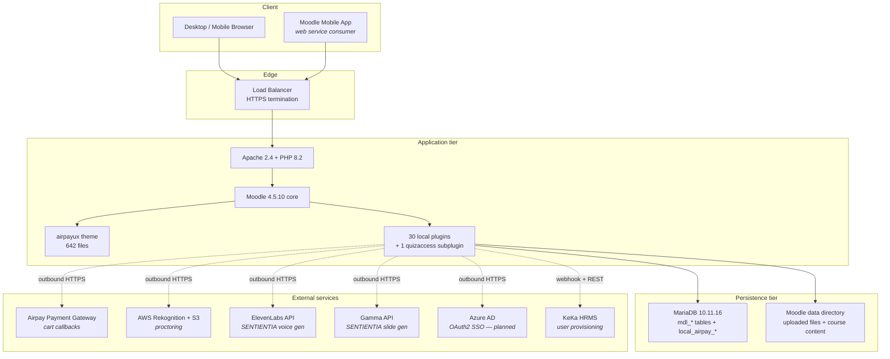

## Section 1 — Platform Overview

### 1.1 Mission and scope

Airpay Academy 2.0 is the canonical platform of record for every form of structured learning that Airpay Payment Services conducts. The scope of that mandate is deliberately broad and covers four distinct demands the business places on the L&D function:

1. **Statutory and regulatory compliance training.** Annual mandatory courses on the Prevention of Sexual Harassment Act, Anti Money Laundering and Know Your Customer regulations, the Digital Personal Data Protection Act, the Information Technology Act and other Reserve Bank of India circulars binding on a payment service provider. The platform must demonstrably prove, in front of an external auditor, that every employee subject to a given regulation has completed the relevant training in the relevant cycle.
2. **Functional capability building.** Product, engineering, sales, customer support, finance and operations training delivered as a mix of self-paced SCORM modules, instructor-led classroom sessions and structured learning paths. Some of this content is built in-house, some is licensed from third parties and packaged into Moodle, and a growing share is generated by the SENTIENTIA pipeline described in Section 7.
3. **Hiring assessment.** The proctored examination module, shipped on 11 May 2026, is intended to host the technical and behavioural assessments that gate candidate progression in Airpay's recruitment funnel. The proctoring stack (identity verification, webcam recording, screen capture, AI-assisted behaviour flagging) was specifically built for this use case.
4. **External commercial training.** The Public tenant (id `77`) hosts learners who are not Airpay employees and who pay for course access through the integrated cart. This is the seed of a commercial offering that productises Airpay's internal training capability for the broader Indian fintech ecosystem.

The platform is **not** intended to replace conversational mentoring, on-the-job shadowing, performance reviews or competency frameworks. Those remain in the Human Capital Management system and in the HRMS (KeKa, with which the platform integrates via the `airpay_integrations` plugin).

### 1.2 Tenancy model

The platform implements a three-tenant model using the BizLMS `local_costcenter` plugin's organisation-tree convention. Each user record in `mdl_user` carries a custom column `open_path` that takes a forward-slash-delimited path string. The first segment of that path is the tenant root identifier and the subsequent segments describe the department hierarchy within that tenant.

| Tenant root | Internal name | Purpose | Active users (production) | Commercial posture |
|---|---|---|---|---|
| `/1` | Airpay | Internal employees of Airpay Payment Services. Training is provided as an employment benefit at no cost to the employee. | 2,188 | Cost centre |
| `/77` | Public | External learners (typically employees of other Indian fintechs, or individual practitioners) who pay for course access. | 676 | Revenue-generating |
| `/177` | ZEEA | A third costcenter operating under an enterprise contract with a separate scope of training entitlements. | 6 | Contract revenue |

The tenancy boundary is enforced at three independent layers throughout the codebase. At the SQL layer, every query that touches user-scoped data is required to include a `costcenterid` predicate or its open-path equivalent. At the capability layer, role assignments are made at category context rather than system context, so that a manager in tenant `/77` cannot operate on resources in tenant `/1`. At the application layer, the shared helper `\local_airpay_core\tenant::require_access()` provides an additional defence-in-depth check on every read and write path that crosses a tenant boundary, regardless of capability ownership. This three-layer enforcement was introduced on 12 May 2026 in direct response to a pre-cutover security audit which identified eleven cross-tenant access paths in the new plugin set that relied on capability checks alone.

### 1.3 User population and role distribution

Approximate distribution of active users by role across the three tenants, taken from the production database snapshot of 12 May 2026:

| Role | Airpay (/1) | Public (/77) | ZEEA (/177) | Total |
|---|---|---|---|---|
| Site administrator | 2 | 0 | 0 | 2 |
| Tenant administrator (category-scoped) | ~10 | 1 | 1 | ~12 |
| Manager (`manager` archetype + manager flag) | ~80 | ~8 | 0 | ~88 |
| Trainer | ~6 | 0 | 0 | ~6 |
| Employee / learner | ~2,090 | ~667 | 5 | ~2,762 |
| **Total** | **~2,188** | **~676** | **~6** | **~2,870** |

The distinction between site administrator and tenant administrator is enforced through the role context level. The two site administrators hold the `manager` archetype at `CONTEXT_SYSTEM` (level 10) and have unrestricted platform-wide privileges. Tenant administrators (notably the Head of L&D and his designated category owners) hold the same role at `CONTEXT_COURSECAT` (level 40) within their tenant's root category. The same role short-name, profoundly different blast radius. This was a meaningful distinction confirmed during multi-role User Acceptance Testing on 12 May 2026, where the Tenant Admin persona was deliberately verified as unable to access site-wide administrative pages.

### 1.4 High-level architecture

The platform follows the standard Moodle three-tier layout — presentation tier in PHP/Mustache served by Apache, business logic tier in PHP classes loaded from the Moodle plugin path, persistence tier in MariaDB with the standard Moodle Database Manipulation Layer (`$DB` API) abstracting all SQL.

The integration model is deliberately conservative. Every outbound HTTPS call from the platform is mediated by a dedicated Airpay plugin class that handles authentication, retry, rate-limit observance and PII redaction. No business workflow allows arbitrary user-supplied URLs to trigger outbound calls, which closes off Server-Side Request Forgery as a class of attack.

### 1.5 Technology stack matrix

| Layer | Component | Version | Purpose | Upgrade path |
|---|---|---|---|---|
| Operating system | Windows Server 2019 (development) / Linux (production) | varies | Host the LAMP stack | Production OS lifecycle managed by IT |
| Web server | Apache | 2.4.58 | HTTP request handling, mod_rewrite for clean URLs | Track upstream stable releases |
| Application runtime | PHP | 8.2.12 | Application execution | Moodle 4.5 supports PHP 8.1–8.3. PHP 8.3 upgrade is a low-risk step once PHP 8.2 reaches end-of-life. |
| Database | MariaDB | 10.11.16 (development) / MySQL 8.0.44 (production) | Persistence for Moodle core tables plus all `local_airpay_*` tables | Moodle 5.x requires MySQL 8 / MariaDB 10.6 minimum. Already aligned. |
| Application framework | Moodle | 4.5.10 (build 20260216) | Core LMS framework, plugin loader, capability system, database manipulation layer | Moodle 5.1.x is on the runway; the local development environment already runs 5.1.3+ and all `airpay_*` plugins have been forward-compatibility tested. |
| Theme | airpayux | 1.0.0 | Standalone fork of the Epsilon premium theme. `$THEME->parents = []` — Airpay owns every file. | Carry forward across Moodle upgrades by re-running the templates against any new core renderer methods Moodle introduces. |
| Local plugin: shared infrastructure | `local_airpay_core` | 1.0.0 | Tenant-scoping helpers used by every other plugin | Versioned in lockstep with sibling plugins. |
| Local plugins: business logic | 29 plugins, see Section 5 | various | One plugin per business capability | Independent versioning with declared dependencies. |
| Quiz access subplugin | `quizaccess_airpay_proctoring` | 1.0.0 | Gate the Moodle quiz attempt lifecycle on a proctoring session being in `recording` state | Tracks the parent `local_airpay_proctoring` plugin. |
| Voice generation | ElevenLabs HTTP API | `eleven_multilingual_v2` model | Convert narration text into MP3 voice tracks for SCORM modules | Vendor-managed API; replace with a self-hosted alternative if voice quality requirements change. |
| Slide generation | Gamma HTTP API | `v0.2` | Convert narration outlines into structured slide decks | Vendor-managed API. |
| Identity verification | AWS Rekognition `CompareFaces` | SigV4-signed | Compare a candidate's identity-document photo to a selfie at the start of a proctored quiz attempt | Vendor-managed; Azure Face API is an interchangeable alternative if the AWS quota becomes a constraint. |
| Object storage | AWS S3 | standard | Store proctoring webcam and screen recordings | Vendor-managed. |
| HRMS | KeKa (external) | tenant-specific | User provisioning, joiner/mover/leaver lifecycle events | Vendor-managed by Airpay's HR team. |
